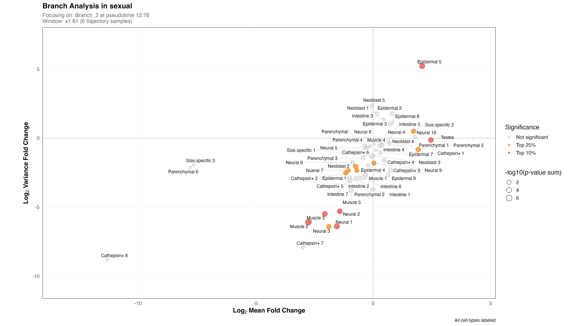
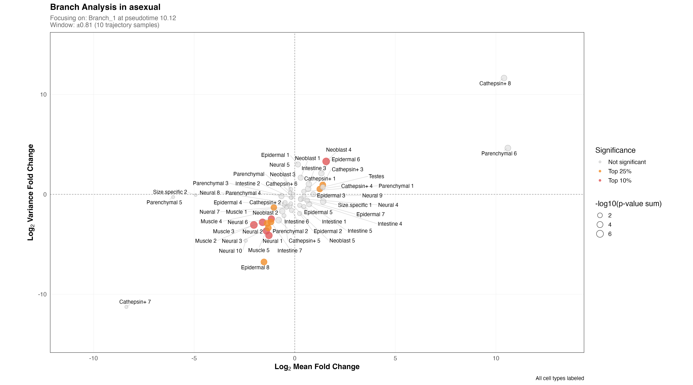
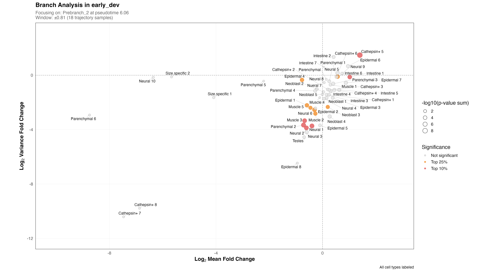
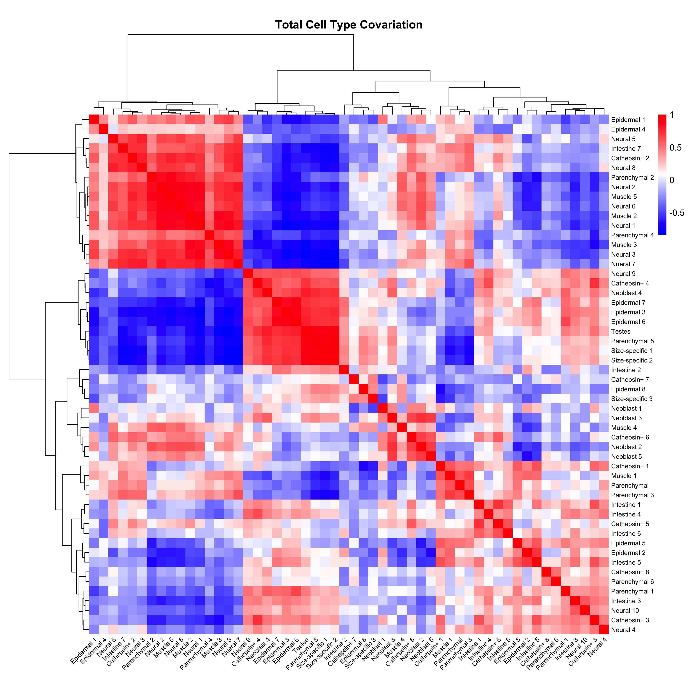
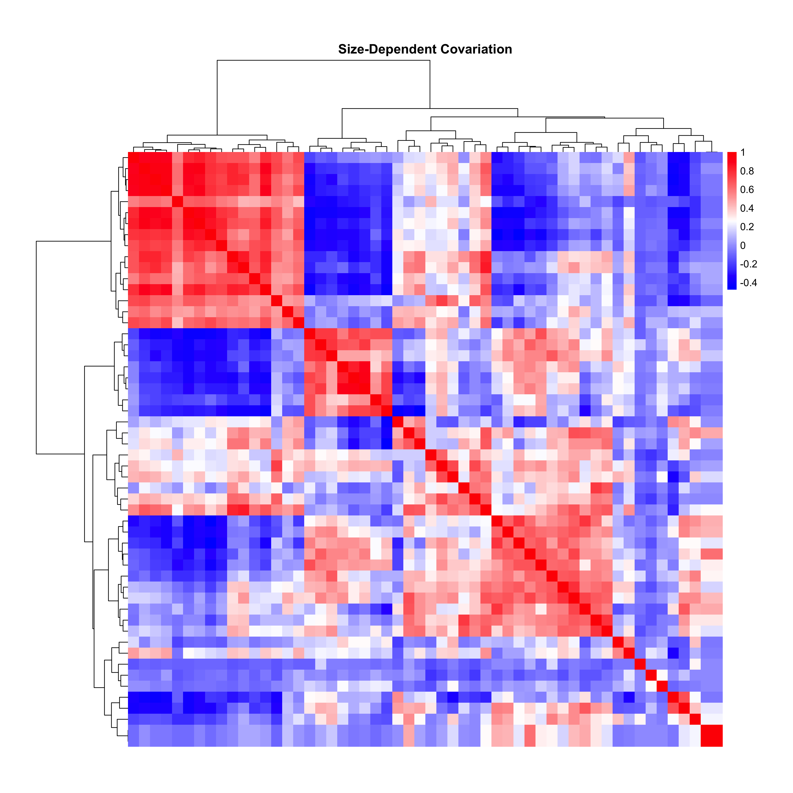
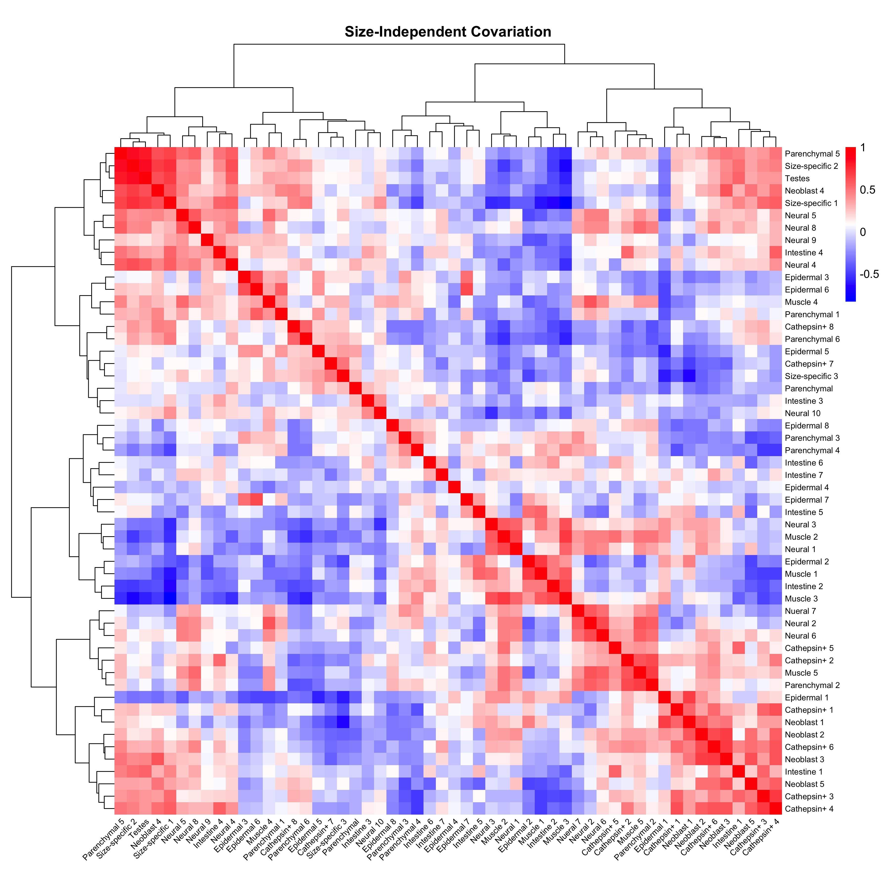
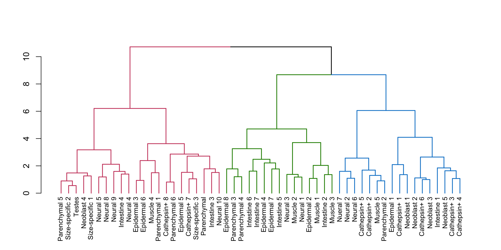
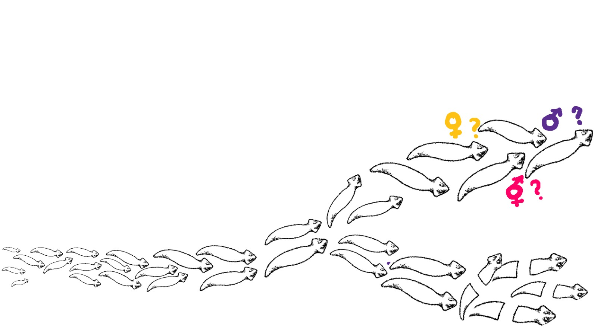

```{r css, results='asis', echo=FALSE}
cat('
<style>

/* Light background */
body {
  transition: background-color 0.3s, color 0.3s;
}

/* Dark background */
body.dark-mode {
  color: #ffffff;
  background-color: #222222;
}

/* Hide first heading */
#contents h1 {
  display: none;
}

/* Justify text */
p, body, div, span, td, th {
  text-align: justify;
}
.tocify-item {
  text-align: left;
}

body.dark-mode .list-group-item {
  color: #ffffff;
  background-color: #222222;
}
body.dark-mode .list-group-item.active,
body.dark-mode .list-group-item.active:hover {
  background: #2c3e50;
}

/* Common Style for all headings */
h1, h2, h3, h4, h5, h6 {
padding-bottom: 1rem;
border-bottom: 1px solid grey;
text-align: left;
}

h3 {
  font-size: 36px;
}
h4 {
  font-size: 30px;
}
h5 {
  font-size: 24px;
}
h6 {
  font-size: 18px;
}

#header h3 {
  font-size: 24px;
}

#header h4 {
  font-size: 18px;
}

#header h1,
#header h3,
#header h4 {
  border: none;
}

#header h1{
text-align: left;
}

body.book-view #header h3 {
color: white;
}

/* Tabs design */
ul.nav-pills {
  margin-top: 2rem;
  border: 1px solid grey;
  border-radius: 4px;
  padding: 1rem;
}

/* Table styling */
table {
  width: 100%;
}
tr:nth-child(even) {
  background-color: #d3d3d3;
}
tr.header { 
background: #2c3e50;
color: white;
}
body.dark-mode table {
  background-color: #333;
}
body.dark-mode tr:nth-child(even) {
  background-color: #444;
}

/* Main Section Styles  */
.section.level3 {
  padding: 1rem 0rem;
  margin-bottom: 1rem;
}
.section.level4,
.section.level5,
.section.level6 {
  padding: 0.5rem 0rem;
}

/* Toggle button style */
.footer-btn {
    cursor: pointer;
    background: #2c3e50;
}

#theme-select {
 color: white;
}

.theme-wrapper {
  background : #2c3e50;
  position: fixed;
  z-index: 1000;
  left: 0px;
  bottom: 0px;
  padding: 1rem 3rem 1rem 2rem;
  display: flex;
  justify-content: space-between;
  width:100vw;
}

.theme-wrapper p,
.theme-wrapper label{
  margin: 0;
  color: white;
}

body.book-view .section.level3 {
  border-radius: 12px;
  border: 1px solid #D3D3D3;
  padding: 1rem 2rem;
  margin: 1.25rem 0rem;
}

body.book-view .section.level4,
body.book-view .section.level5,
body.book-view .section.level6 {
  padding: 0.5rem 0rem 0rem 2rem;
}

/* Blue Header Styles */
body.book-view #header {
    border-radius: 12px;
    border: 1px solid grey;
    padding: 0rem 2rem;
    margin: 25px 0 1rem 0;
    background-image: repeating-linear-gradient(90deg, rgba(140,140,140, 0.1) 0px, rgba(140,140,140, 0.1) 1px,transparent 1px, transparent 60px),repeating-linear-gradient(0deg, rgba(140,140,140, 0.1) 0px, rgba(140,140,140, 0.1) 1px,transparent 1px, transparent 60px),repeating-linear-gradient(0deg, rgba(140,140,140, 0.1) 0px, rgba(140,140,140, 0.1) 1px,transparent 1px, transparent 20px),repeating-linear-gradient(90deg, rgba(140,140,140, 0.1) 0px, rgba(140,140,140, 0.1) 1px,transparent 1px, transparent 20px),linear-gradient(90deg, hsl(210, 29%, 24%),hsl(210, 29%, 24%));
}

body.book-view #header h1,
body.book-view #header h4 {
  color: white;
  border: none;
}

.plotly {
  width: 100% !important;
  display: flex;
  justify-content: center;
}

p > img {
  display: block;
  margin-left: auto;
  margin-right: auto;
}

</style>
')
```


```{r js, results='asis', echo=FALSE}
cat('
<div class="theme-wrapper">
  <p> Aishwarya Girish </p>
<div>
  <label>Switch Theme : </label>
  <select id="theme-select" class="footer-btn">
    <option class="footer-btn" value="light">Light</option>
    <option class="footer-btn" value="dark">Dark</option>
    <option class="footer-btn" value="book">Book</option>
  </select>
</div>

</div>

<script>
document.getElementById("theme-select").addEventListener("change", function() {
  const body = document.body;
  const selected = this.value;

  // Remove both classes
  body.classList.remove("dark-mode", "book-view");

  // Add class based on selection
  if (selected === "dark") {
    body.classList.add("dark-mode");
  } else if (selected === "book") {
    body.classList.add("book-view");
  }
});
</script>
')
```


```{r setup, include=FALSE}
# knitr::opts_chunk$set(echo = TRUE, message = FALSE, warning = FALSE)
```


# Contents {.tabset .tabset-pills}

## Report

### 1. Introduction

Developmental bifurcations represent critical transitions in which cells or organisms diverge into distinct phenotypic fates. The freshwater planarian _Phagocata morgani (P. morgani)_ undergoes such a bifurcation, developing into either an asexual or a sexual reproductive phenotype, each associated with a distinct growth trajectory. However, the mechanisms that govern these divergent outcomes, particularly the specific cell types that drive commitment toward either fate, remain poorly understood.

**This notebook presents a quantitative framework for identifying cell-type-specific drivers of sexual and asexual growth trajectories in _P. morgani_.** A particular focus is placed on identifying cell-type behaviour around the bifurcation points as they are regions in the developmental manifold where fate decisions are likely to occur. By statistically evaluating these transitions, candidate cellular populations that may act as intermediates or determinants of reproductive fate are identified.

The notebook is organized to guide the reader through each step of this analysis: from data preprocessing and pseudotime trajectory inference to cell-type abundance modeling and statistical enrichment testing. It serves as both a computational workflow and an interpretative tool for understanding the cellular dynamics in planaria.

#### 1.1. Background

Development in _P. morgani_ proceeds along distinct trajectories that give rise to sexual and asexual phenotypes. These trajectories are shaped by both environmental cues and intrinsic organismal properties, such as body size. To begin disentangling these factors, worms were maintained at a constant temperature of 17.5℃ — a condition known to sustain a mixed population of sexual and asexual individuals. This temperature was specifically chosen to allow for the separation of size-dependent effects from temperature-driven variation in cellular differentiation dynamics.

A single-cell atlas was constructed from this population by isolating nuclei from individual worms. Each worm was flash frozen and processed independently, with one worm per well in a 96-well plate. Prior to freezing, a video recording was captured for each worm, enabling quantification of morphological features such as body area and length using a standardized image analysis pipeline.

The resulting dataset was processed into a gene expression matrix and subsequently converted into a cell-type abundance matrix, where each row represents an individual worm and each column corresponds to a broad cell type. To ensure analytical robustness, cell types with extremely low abundance (<50 cells) across all samples were filtered out. Worm-level cell counts were then aggregated based on assigned cell-type annotations, yielding a worm-by-cell-type matrix reflecting absolute cell composition.

In parallel, morphological measurements (specifically worm length and area) were extracted for each sample to serve as covariates in downstream modeling. The raw count matrix was normalized using Monocle3's size factor estimation framework to account for differences in total nuclei recovered per worm. This step corrected for variability in sequencing depth and overall cell recovery, enabling meaningful comparisons of cell-type proportions across worms. 

The resulting size-normalized matrix forms the basis for all subsequent analyses.

#### 1.2. Getting Started

To ensure reproducibility and transparency, all analyses were performed within an RNotebook framework using R (version 4.4.2). The Monocle3 package (Trapnell lab) was utilized for single-cell trajectory inference and normalization. Dependencies including Bioconductor packages and common data manipulation and visualization libraries were loaded as detailed below.

##### 1.2.1. Installation and Setup

```{r installation and setup}
# Package Installation
required_packages <- c(
  # Core analysis
  "dplyr", "tidyr", "data.table", "ggplot2", "tibble",
  # Visualization
  "plotly", "pheatmap", "htmlwidgets", "gridExtra", "dendextend", "readr",
  # Data processing
  "VGAM", "zoo", "broom", "reshape2", "purrr", "splines"
)

# Install CRAN packages
new_packages <- required_packages[!(required_packages %in% installed.packages()[,"Package"])]
if(length(new_packages)) {
  install.packages(new_packages, dependencies = TRUE)
}

# Install Bioconductor packages
if (!requireNamespace("BiocManager", quietly = TRUE)) {
  install.packages("BiocManager")
}

bioc_packages <- c(
  'BiocGenerics', 'DelayedArray', 'DelayedMatrixStats',
  'limma', 'lme4', 'S4Vectors', 'SingleCellExperiment',
  'SummarizedExperiment', 'batchelor', 'HDF5Array',
  'terra', 'ggrastr'
)

new_bioc <- bioc_packages[!(bioc_packages %in% installed.packages()[,"Package"])]
if(length(new_bioc)) {
  BiocManager::install(new_bioc)
}

# Install GitHub packages
if (!requireNamespace("devtools", quietly = TRUE)) {
  install.packages("devtools")
}

if (!requireNamespace("remotes", quietly = TRUE)) {
  install.packages("remotes")
}

github_packages <- c(
  'cole-trapnell-lab/monocle3',
  'pln-team/PLNmodels',
  'cole-trapnell-lab/hooke'
)

# Check which GitHub packages need installation
if (!requireNamespace("monocle3", quietly = TRUE)) {
  devtools::install_github(github_packages[1])
}
if (!requireNamespace("PLNmodels", quietly = TRUE)) {
  remotes::install_github(github_packages[2])
}
if (!requireNamespace("hooke", quietly = TRUE)) {
  devtools::install_github(github_packages[3])
}

# Load all packages
all_packages <- c(required_packages, "monocle3", "PLNmodels", "hooke")

invisible(lapply(all_packages, function(pkg) {
  if (!require(pkg, character.only = TRUE)) {
    warning(paste("Package", pkg, "failed to load"))
  }
}))

# Verify loading
loaded <- sapply(all_packages, require, character.only = TRUE, quietly = TRUE)
if(all(loaded)) {
  message("All packages loaded successfully")
} else {
  warning("Failed to load: ", paste(names(loaded)[!loaded], collapse = ", "))
}

# # Print session info
# message("\nSession info:")
# sessionInfo()

```

##### 1.2.2. Set Working Directory

The working directory was set to organize data and results appropriately.

```{r working directory}

setwd("/home/aishwarya/R/dorrity_lab_embl") #enter your working directory

```

### 2. Trajectory Inference Using Monocle3

To elucidate growth progression within the single-cell size atlas, trajectory inference was conducted using Monocle3. 
**Principal component analysis (PCA) embeddings, specifically the first three principal components, were utilized in place of default UMAP embeddings to better represent the global structure of the data.**

(Note: Principal Component Analysis (PCA) was selected over Uniform Manifold Approximation and Projection (UMAP) embeddings for trajectory inference due to PCA’s ability to preserve global data structure and variance. Unlike UMAP, which emphasizes local neighborhood relationships and nonlinear manifold learning primarily for visualization, PCA provides a linear projection that retains the largest sources of variation across the entire dataset. This characteristic is crucial when modeling developmental trajectories, as it ensures that the principal axes represent meaningful biological gradients—such as size and differentiation status—rather than focusing solely on local clustering. Using PCA embeddings thus enables more robust and interpretable inference of pseudotemporal progression in complex single-cell data.)

Given that morphological size in _P. morgani_ correlates strongly with developmental stage, worm length (Lengthmm) was used as a biologically informed proxy for pseudotime, here referred to as pseudosize. Cells were clustered at high resolution to resolve fine-grained cell states, and a principal graph was constructed across the PCA spaceto model putative differentiation trajectories. Pseudotime values were then inferred along this graph, capturing size-associated developmental progression across individual worms. This approach facilitated the characterization and visualization of divergent cellular trajectories underlying sexual and asexual differentiation.


```{r trajectory monocle3}

# Load preprocessed cell_data_set object
cds <- readRDS("size-cds-cellcounts_3e-5-highRes-cell-type.rds")
# Replace default UMAP embeddings with first three PCA components for dimensionality reduction
cds@int_colData@listData$reducedDims@listData$UMAP <- cds@int_colData@listData$reducedDims@listData$PCA[, 1:3]

# Cluster cells at a low resolution for fine granularity
cds <- cluster_cells(cds, resolution = 3e-5)
plot_cells_3d(cds, color_cells_by="Lengthmm")

# Learn principal graph to model developmental trajectories
cds <- learn_graph(cds, learn_graph_control=list(ncenter=7, prune_graph=FALSE, minimal_branch_len=1))
plot_cells_3d(cds, color_cells_by="Lengthmm", cell_size = 30)

# Order cells along the learned trajectory (interactive mode)
#cds <- order_cells(cds)

# Order Cells (NOTE: The root node was initially found in the interactive mode, but here the input is automated for a smooth knitting of the final HTML document.)

root_node <- "Y_6"  

cds <- order_cells(cds, root_pr_nodes = root_node)

# Assign pseudotime values reflecting developmental progression correlated with worm size
cds$pseudosize_pca <- pseudotime(cds)
monocle3_trajectory_plot <- plot_cells_3d(cds, color_cells_by="pseudosize_pca")
monocle3_trajectory_plot


# Extract and arrange metadata by pseudotime for downstream analysis
coldat <- as.data.frame(colData(cds))
coldat <- coldat %>% arrange(pseudosize_pca)

rowdat <- as.data.frame(rowData(cds))

# Extract and reorder counts matrix according to sample order in metadata
cell_counts <- as.matrix(counts(cds))[, coldat$sample]


# Calculate variance explained by PCA components to assess dimensionality reduction
var_explained <- cds@reduce_dim_aux$PCA@listData$model$prop_var_expl
var_explained                                # vector for every PC
sum(var_explained[1:3])                      # cumulative for PC1–PC3
sum(var_explained[1:7])                      # cumulative for PC1–PC7

if (!dir.exists("trajectory_output")) dir.create("trajectory_output")

# Save interactive 3D trajectory plot as an HTML widget
saveWidget(monocle3_trajectory_plot, "trajectory_output/monocle3_trajectory_plot.html", selfcontained = TRUE)

```


#### 2.1. Dimensionality and Clustering

To determine the appropriate number of clusters in the PCA space, unsupervised k-means clustering was performed on the first three principal components of the cell type composition data. The working hypothesis was that incorporating more principal components (thereby capturing a greater proportion of variance) would yield finer-grained clusters and improve resolution. However, this hypothesis was not supported by the data.

Contrary to expectations, increasing the number of principal components (e.g., 7 PCs to capture ~80–90% of the variance) resulted in a decrease in the number of biologically meaningful clusters. This observation suggests that the additional components may predominantly capture technical noise or low-variance structure, thereby diluting the signal necessary for robust clustering. In contrast, the first three components, which collectively explain approximately 66% of the variance, retained the most relevant biological structure for delineating distinct cell states.

##### 2.1.1. K-Means Elbow Plot 

To assess cluster structure, a standard elbow plot was constructed by computing the total within-cluster sum of squares (WSS) for a range of k values. The maximum number of clusters evaluated was set to k = 15 to allow for detection of an inflection point in the within-cluster sum of squares (WSS) curve. This upper limit was chosen to exceed the anticipated number of biologically relevant clusters while avoiding excessive partitioning of the data. The WSS curve exhibited a distinct elbow, beyond which increases in k yielded minimal gains, indicating the optimal number of clusters. A distinct inflection point in the WSS curve indicated the optimal number of clusters **(k=4)**, balancing model complexity and explanatory power.

```{r k-means elbow plot}

# Needs ggplot2 and Monocle3 which were already loaded earlier
library(purrr)

# Extract PCA coordinates (first 3 PCs)
pca_coords <- reducedDims(cds)$PCA[, 1:3]  # Adjust to 1:3 if using 3D

# Calculate WSS for k=1 to k=15
set.seed(123)  # Reproducibility
max_k <- 15
wss <- map_dbl(1:max_k, ~{
  kmeans(pca_coords, centers = .x, nstart = 25, iter.max = 50)$tot.withinss
})

# Plot ELbow Curve

elbow_plot <- ggplot(data.frame(k = 1:max_k, WSS = wss), aes(x = k, y = WSS)) +
  geom_line(color = "#377EB8", linewidth = 1.2) +
  geom_point(color = "#E41A1C", size = 3) +
  labs(
    title = "K-means Elbow Plot (PCA Space)",
    x = "Number of clusters (k)",
    y = "Total Within-Cluster Sum of Squares (WSS)"
  ) +
  scale_x_continuous(breaks = 1:max_k) +
  theme_minimal() +
  theme(
    text = element_text(family = "Helvetica"),
    plot.title = element_text(face = "bold", hjust = 0.5),
    panel.grid.minor = element_blank(),
    
    # Solid white background for panel
    panel.background = element_rect(fill = "white", color = NA),
    # Add border around the plot panel
    panel.border = element_rect(color = "black", fill = NA, linewidth = 0.5),
    
    # Optional: add border around entire plot (including margin)
    plot.background = element_rect(color = "black", fill = "white", linewidth = 0.5)
  )

print(elbow_plot)

# Save plot
ggsave("trajectory_output/elbow_plot.png", plot = elbow_plot, width = 8, height = 6, dpi = 300)


```

```{r 4 clusters direct, echo = FALSE} 

#############################################################################################################################################################################

# This chunk of code is unrefined for the following reasons:

#The cluster assignment is not pseudotime ordered and it is a little complicated. I have fixed it in the point number 2 in this code but, it doesn't follow through well with the rest of the code. It is particularly bad with identifying the branch points with the current logic. I am sure that we can write a more complicated logic for figuring out the branch points correctly with this clustering, but I think the elegance lies in the simplicity of the code used in the next R chunk labelled "4 clusters".

#############################################################################################################################################################################

# # Run k-means clustering with k=4
# coords <- reducedDims(cds)$PCA[, 1:3]
# set.seed(123)
# km4 <- kmeans(coords, centers = 4)
# 
# # Map numeric clusters (1:4) to cluster names in a vector, e.g.:
# cluster_names <- c("Branch_1", "Prebranch_1", "Branch_2", "Prebranch_2")
# 
# # Map the numeric cluster assignments to cluster names
# cds$branch <- factor(cluster_names[km4$cluster], levels = cluster_names)
# 
# # Define fixed colors matching the cluster names:
# branch_colors <- c(
#   "Prebranch_1" = "#999999",  # grey
#   "Prebranch_2" = "orange",   # orange
#   "Branch_1"    = "#377EB8",  # blue
#   "Branch_2"    = "#E41A1C"   # red
# )
# 
# library(plotly)
# 
# # Extract pseudotime vector (optional ordering within clusters)
# pseudotime <- cds$pseudosize_pca
# names(pseudotime) <- colnames(cds)
# 
# # Initialize 3D plot
# clustering_plot_4 <- plot_ly()
# 
# # Plot each cluster ordered by pseudotime
# for(branch in levels(cds$branch)) {
#   idx <- which(cds$branch == branch)
#   if(length(idx) > 0) {
#     ordered_idx <- idx[order(pseudotime[idx])]
#     
#     clustering_plot_4 <- clustering_plot_4 %>% add_trace(
#       x = coords[ordered_idx, 1],
#       y = coords[ordered_idx, 2],
#       z = coords[ordered_idx, 3],
#       type = "scatter3d",
#       mode = "markers",
#       marker = list(
#         size = 4,
#         color = branch_colors[branch]
#       ),
#       name = branch,
#       showlegend = TRUE
#     )
#   }
# }
# 
# # Layout
# clustering_plot_4 <- clustering_plot_4 %>% layout(
#   scene = list(
#     xaxis = list(title = "PC1"),
#     yaxis = list(title = "PC2"),
#     zaxis = list(title = "PC3")
#   ),
#   legend = list(orientation = "h")
# )
# 
# clustering_plot_4


```

##### 2.1.2. K-Means Clustering

To identify discrete cellular states along the developmental trajectory, K-means clustering was performed on cells embedded in PCA space and ordered by pseudotime. All cells were initially assigned to a common early-state label (Prebranch_1). Cells exceeding a defined pseudotime threshold were considered post-branch and partitioned into two major clusters: Branch_1 and Branch_2. 

**An intermediate cluster, Prebranch_2, emerged within the transitional pseudotime window, representing a putative pre-commitment state preceding bifurcation.**Importantly, clustering into three groups revealed a branch point along the growth trajectory that precedes the divergence into asexual and sexual pathways (Branch_1 and Branch_2 respectively). This early inflection is primarily represented by samples assigned to the Prebranch_2 cluster. The distinct positioning of this group suggests that a critical shift in cellular composition or developmental state may occur upstream of overt sexual differentiation. This observation raises the possibility that Prebranch_2 corresponds to a transitional phase characterized by an early commitment or upregulation of developmental programs.

These data-driven clusters delineate key stages of growth in _P. morgani_, with Branch_1 and Branch_2 corresponding to the committed asexual and sexual fates, respectively. Visualization in 3D PCA space confirmed that the inferred clusters recapitulate the underlying structure of developmental divergence.

| Cluster       | Description                                  | Color    |
|---------------|----------------------------------------------|----------|
| Prebranch_1   | Early developmental state (common root)      | Gray     |
| Prebranch_2   | Transitional pre-commitment state            | Orange   |
| Branch_1      | Terminal state of the asexual trajectory	   | Blue     |
| Branch_2	    | Terminal state of the sexual trajectory      | Red      |

```{r 4 clusters}

# Initialize all cells as prebranch_1
cds$branch <- "Prebranch_1"

#vIdentify post-branch cells using pseudotime threshold
pseudotime_threshold <- quantile(cds$pseudosize_pca, probs = 0.33)
post_branch_idx <- which(cds$pseudosize_pca > pseudotime_threshold)

# Branching logic (Main bifurcation: split post-branch cells into two clusters)
if(length(post_branch_idx) > 10) {
  post_coords <- reducedDims(cds)$PCA[post_branch_idx, 1:3]
  set.seed(123)
  km <- kmeans(post_coords, centers = 2)
  cds$branch[post_branch_idx] <- ifelse(km$cluster == 1, "Branch_1", "Branch_2")
  
  # Secondary clustering (Secondary bifurcation: split Branch_1 into Prebranch_2 and Branch_1)
  branch1_idx <- which(cds$branch == "Branch_1")
  if(length(branch1_idx) > 5) {
    branch1_coords <- reducedDims(cds)$PCA[branch1_idx, 1:3]
    set.seed(123)
    km2 <- kmeans(branch1_coords, centers = 2)
    cds$branch[branch1_idx] <- ifelse(km2$cluster == 1, "Branch_1", "Prebranch_2")
  }
}

# Define and order final cluster labels
cds$branch <- factor(cds$branch, 
                     levels = c("Prebranch_1", "Prebranch_2", "Branch_1", "Branch_2"))

names(cds$branch) <- colnames(cds)

# Color scheme
branch_colors <- c(
  "Prebranch_1" = "#999999",
  "Branch_1" = "#377EB8",
  "Prebranch_2" = "orange",
  "Branch_2" = "#E41A1C"
)


# 3D scatter plot of clusters 
clustering_plot_4 <- plot_ly()

for(branch in levels(cds$branch)) {
  if(any(cds$branch == branch)) {
    clustering_plot_4 <- clustering_plot_4 %>% add_trace(
      x = reducedDims(cds)$PCA[cds$branch == branch, 1],
      y = reducedDims(cds)$PCA[cds$branch == branch, 2],
      z = reducedDims(cds)$PCA[cds$branch == branch, 3],
      type = "scatter3d", mode = "markers",
      marker = list(
        size = ifelse(branch == "Prebranch_1", 4, 4),
        color = branch_colors[branch]
      ),
      name = branch
    )
  }
}

clustering_plot_4 <- clustering_plot_4 %>% 
  config(autosizable = TRUE) %>% 
  layout(
    scene = list(
      xaxis = list(title = "PC1"),
      yaxis = list(title = "PC2"),
      zaxis = list(title = "PC3")
    ),
    legend = list(
      orientation = "h", 
      x = 0.5, 
      xanchor = "center", 
      y = -0.15,  # Try more negative values if needed
      yanchor = "top"
    )
  )

clustering_plot_4

# Save plot
saveWidget(clustering_plot_4, "trajectory_output/clustering_plot_4.html", selfcontained = TRUE)

#NOTE: Another idea would be to try the Leiden clustering. Since Monocle3 already does that in the learn_graph() step, the k-means clustering (as illustrated above) should suffice.
```


#### 2.2. Defining Trajectories

To enable focused downstream analyses, four biologically relevant trajectory subsets were delineated, each representing specific stages or fate decisions within _P. morgani_ growth:

 + Early Development: comprising Prebranch_1 and Prebranch_2, representing initial stages prior to major fate commitment.

 + Asexual Trajectory: encompassing Prebranch_1, Prebranch_2, and Branch_1, corresponding to the developmental path leading to asexual worms.

 + Sexual Trajectory: including Prebranch_1, Prebranch_2, and Branch_2, representing the trajectory towards sexual differentiation.

 + Late Development: consisting of Branch_1 and Branch_2, capturing the terminal phases of both asexual and sexual lineages.
 
These trajectory definitions provide a structured framework for systematic comparison of cell type composition, dynamic variability, and pseudotemporal progression.


```{r trajectory definitions}

## Defining Clusters and Trajectories

# Set consistent cluster ordering and associated colors
branch_order <- c("Prebranch_1", "Prebranch_2", "Branch_1", "Branch_2")
branch_colors <- c(
  "Prebranch_1" = "#999999",  # grey
  "Prebranch_2" = "orange",   # orange
  "Branch_1"    = "#377EB8",  # blue
  "Branch_2"    = "#E41A1C"   # red
)

#coldat$cluster <- cds$branch[rownames(coldat)]  

# Assign cluster labels to cells
coldat$cluster <- as.character(cds$branch)[match(rownames(coldat), names(cds$branch))]
coldat$cluster <- factor(coldat$cluster, levels = c("Prebranch_1", "Prebranch_2", "Branch_1", "Branch_2"))

# Define trajectory groupings and their branch composition
trajectories <- list(
  early_dev = list(
    name = "Early Development",
    branches = c("Prebranch_1", "Prebranch_2"),
    color = c("#999999", "orange")
  ),
  asexual = list(
    name = "Asexual Trajectory",
    branches = c("Prebranch_1", "Prebranch_2", "Branch_1"),
    color = c("#999999", "orange", "#377EB8")
  ),
  sexual = list(
    name = "Sexual Trajectory",
    branches = c("Prebranch_1", "Prebranch_2", "Branch_2"),
    color = c("#999999", "orange", "#E41A1C")
  ),
  late_dev = list(
    name = "Late Development",
    branches = c("Branch_1", "Branch_2"),
    color = c("#377EB8", "#E41A1C")
  ),
  all_clusters = list(
    name = "All Clusters",
    branches = levels(cds$branch),
    color = unname(branch_colors[levels(cds$branch)])
  )
)


# Optional diagnostic: Check how many cells fall under each trajectory
for (traj_name in names(trajectories)) {
  clusters <- trajectories[[traj_name]]$branches
  cells <- rownames(coldat)[coldat$cluster %in% clusters]
  cat(sprintf("Trajectory '%s' contains %d cells across clusters: %s\n",
              traj_name, length(cells), paste(clusters, collapse = ", ")))
}


```


##### 2.2.1. Defining Branch Points and Visualizing Trajectories

Branch points within the developmental trajectory were identified as the minimum pseudotime values corresponding to transitions into distinct clusters (Prebranch_2, Branch_1, Branch_2). These branch points mark critical fate decisions along the pseudotemporal axis derived from the PCA embedding.

```{r branch point identification}
# Ensure pseudotime is available
if ("pseudosize_pca" %in% colnames(colData(cds))) {

  # Find branch transitions
  transitions <- list(
    Prebranch_2 = min(cds$pseudosize_pca[cds$branch == "Prebranch_2"], na.rm = TRUE),
    Branch_1 = min(cds$pseudosize_pca[cds$branch == "Branch_1"], na.rm = TRUE), 
    Branch_2 = min(cds$pseudosize_pca[cds$branch == "Branch_2"], na.rm = TRUE)
  )

  # Remove any invalid transitions (Inf, NA)
  transitions <- transitions[!is.infinite(unlist(transitions)) & !is.na(unlist(transitions))]

  # Create base 3D plot
  base_plot <- plot_cells_3d(
    cds,
    color_cells_by = "branch",
    cell_size = 30,
    trajectory_graph_color = "black",
    trajectory_graph_segment_size = 3
  )

  branch_points_plot <- base_plot

  # Helper: Get PCA coordinates near pseudotime ---
  get_coords_at_pseudotime <- function(cds, pseudotime_val) {
    idx <- which.min(abs(cds$pseudosize_pca - pseudotime_val))
    reducedDims(cds)$PCA[idx, 1:3]
  }

  # Add branch points with clean labels
  for (branch in names(transitions)) {
    coords <- get_coords_at_pseudotime(cds, transitions[[branch]])

    branch_points_plot <- branch_points_plot %>% add_trace(
      x = coords[1], y = coords[2], z = coords[3],
      type = "scatter3d",
      mode = "markers",
      marker = list(
        size = 12,
        color = branch_colors[branch],
        symbol = "diamond"
      ),
      name = sprintf("%s (t=%.2f)", branch, transitions[[branch]]),
      hoverinfo = "text",
      text = sprintf("%s start\nPseudotime: %.2f\nPC1: %.1f\nPC2: %.1f\nPC3: %.1f",
                     branch, transitions[[branch]], coords[1], coords[2], coords[3]),
      showlegend = TRUE
    )
  }

  # Create density plot with ordered legend
  branch_order <- c("Prebranch_1", "Prebranch_2", "Branch_1", "Branch_2")
  plot_data <- as.data.frame(colData(cds))
  plot_data$branch <- factor(plot_data$branch, levels = branch_order)

  density_plot <- ggplot(plot_data, 
                       aes(x = pseudosize_pca, fill = branch)) +
      geom_density(alpha = 0.5) +
      geom_vline(xintercept = unlist(transitions), 
                 linetype = "dashed",
                 color = branch_colors[names(transitions)]) +
      scale_fill_manual(values = branch_colors[branch_order],
                        breaks = branch_order) +
      labs(x = "Pseudotime", y = "Density", title = "Branch Transitions") +
      theme_minimal() +
      theme(
          text = element_text(family = "Helvetica"),
          legend.position = "bottom",
          legend.justification = "center",
          plot.title = element_text(hjust = 0.5, face = "bold"),  
          panel.border = element_rect(color = "black", fill = NA, size = 0.5),  
          plot.background = element_rect(color = "black", fill = NA, linewidth = 0.5)  
    )

  # Optional: Print transition info
  cat("=== Branch Transition Pseudotimes ===\n")
  print(data.frame(
    Branch = names(transitions),
    Pseudotime = round(unlist(transitions), 2),
    PC1 = sapply(names(transitions), function(x) round(reducedDims(cds)$PCA[which.min(abs(cds$pseudosize_pca - transitions[[x]])), 1], 2)),
    PC2 = sapply(names(transitions), function(x) round(reducedDims(cds)$PCA[which.min(abs(cds$pseudosize_pca - transitions[[x]])), 2], 2)),
    PC3 = sapply(names(transitions), function(x) round(reducedDims(cds)$PCA[which.min(abs(cds$pseudosize_pca - transitions[[x]])), 3], 2))
  ))

  # Return plots
  print(branch_points_plot)
  print(density_plot)

} else {
  warning("Pseudotime column 'pseudosize_pca' not found")
  NULL
}

#Save plots
ggsave("trajectory_output/density_plot.png", plot = density_plot, width = 8, height = 6, dpi = 300)

saveWidget(branch_points_plot, "trajectory_output/ branch_points_plot.html", selfcontained = TRUE)


```


```{r trajectories trial, echo = FALSE}

############################################################################################################################################################

#THIS IS A TRIAL CODE FOR THE NEXT PART. IT DEFINES THE INDIVIDUAL TRAJECTORIES CORRECTLY BUT LACKS THE OVERLAY OF THE MONOCLE3 TRAJECTORY (IN BLACK COLOR)

############################################################################################################################################################

# # Define trajectories with sample information
# trajectories <- list(
#   early_dev = list(
#     name = "Early Development",
#     branches = c("Prebranch_1", "Prebranch_2"),
#     color = c("#999999", "orange")  # Grey, Orange
#   ),
#   asexual = list(
#     name = "Asexual Trajectory", 
#     branches = c("Prebranch_1", "Prebranch_2", "Branch_1"),
#     color = c("#999999", "orange", "#377EB8")  # Grey, Orange, Blue
#   ),
#   sexual = list(
#     name = "Sexual Trajectory",
#     branches = c("Prebranch_1", "Prebranch_2", "Branch_2"),
#     color = c("#999999", "orange", "#E41A1C")  # Grey, Orange, Red
#   ),
#   late_dev = list(
#     name = "Late Development",
#     branches = c("Branch_1", "Branch_2"),
#     color = c("#377EB8", "#E41A1C")  # Blue, Red
#   )
# )
# 
# # Add sample IDs to each trajectory
# for (traj_name in names(trajectories)) {
#   trajectories[[traj_name]]$samples <- rownames(colData(cds))[cds$branch %in% trajectories[[traj_name]]$branches]
# }
# 
# # Create plots for each trajectory
# trajectory_plots <- lapply(trajectories, function(traj) {
#   # Create a copy of branch colors for this plot
#   plot_colors <- branch_colors
#   # Fade out non-trajectory branches (very light grey)
#   plot_colors[!names(plot_colors) %in% traj$branches] <- "#F0F0F0"
#   
#   # Base plot
#   p <- plot_ly() %>%
#     layout(
#       scene = list(
#         xaxis = list(title = "PC1"),
#         yaxis = list(title = "PC2"), 
#         zaxis = list(title = "PC3"),
#         camera = list(eye = list(x = -1.5, y = -1.5, z = 1.5))
#       ),
#       title = list(text = traj$name, y = 0.95, x = 0.5, xanchor = "center"),
#       legend = list(orientation = "h")
#     )
#   
#   # Add all cells (non-trajectory cells in light grey)
#   for(branch in levels(cds$branch)) {
#     p <- p %>% add_trace(
#       x = reducedDims(cds)$PCA[cds$branch == branch, 1],
#       y = reducedDims(cds)$PCA[cds$branch == branch, 2],
#       z = reducedDims(cds)$PCA[cds$branch == branch, 3],
#       type = "scatter3d", 
#       mode = "markers",
#       marker = list(
#         size = ifelse(branch %in% traj$branches, 4, 2),  # Smaller for faded cells
#         color = plot_colors[branch],
#         opacity = ifelse(branch %in% traj$branches, 1, 0.3)  # More transparent for faded
#       ),
#       name = ifelse(branch %in% traj$branches, branch, paste0(branch, " (other)")),
#       showlegend = branch %in% traj$branches  # Only show legend for trajectory branches
#     )
#   }
#   
#   # Highlight trajectory path (thicker black line)
#   p <- p %>% add_trace(
#     x = cds@principal_graph_aux$PCA$dp_mst[,1],
#     y = cds@principal_graph_aux$PCA$dp_mst[,2], 
#     z = cds@principal_graph_aux$PCA$dp_mst[,3],
#     type = "scatter3d",
#     mode = "lines",
#     line = list(color = "black", width = 8),
#     name = "Trajectory",
#     showlegend = FALSE
#   )
#   
#   # Add transition points (only for branches in this trajectory)
#   for (branch in intersect(names(transitions), traj$branches)) {
#     coords <- reducedDims(cds)$PCA[which.min(abs(cds$pseudosize_pca - transitions[[branch]])), 1:3]
#     p <- p %>% add_trace(
#       x = coords[1], y = coords[2], z = coords[3],
#       type = "scatter3d",
#       mode = "markers",
#       marker = list(
#         size = 12,
#         color = branch_colors[branch],
#         symbol = "diamond"
#       ),
#       name = sprintf("%s (t=%.1f)", branch, transitions[[branch]]),
#       hoverinfo = "text",
#       text = sprintf("%s start\nPseudotime: %.2f", branch, transitions[[branch]]),
#       showlegend = TRUE
#     )
#   }
#   
#   return(p)
# })
# 
# # Display all plots
# trajectory_plots$early_dev
# trajectory_plots$asexual
# trajectory_plots$sexual 
# trajectory_plots$late_dev
# 
# # You can also save these plots
# # htmlwidgets::saveWidget(as_widget(trajectory_plots$early_dev), "early_dev.html")
```


```{r trajectories}

# Minimum Spanning Tree coordinates (3 rows = PC1, PC2, PC3; 7 cols = nodes) manually retrieved from Monocle3 cds object: cds@principal_graph_aux@listData[["UMAP"]][["dp_mst"]]

mst_coords_raw <- matrix(
  c(-1.002902,  1.8693896,  1.892249,  3.2705521,  4.21178119, -5.3767044, -3.54361406,
    -1.385229, -1.9476252, -2.767477,  0.5152539,  3.19226895,  1.3584236,  0.07889964,
    -2.016103, -0.8172786,  2.155795, -0.4427244,  0.01372972,  0.9358482, -0.44058576),
  nrow = 3, byrow = TRUE,
  dimnames = list(c("PC1", "PC2", "PC3"), paste0("Y_", 1:7))
)

# Transpose so rows = nodes, cols = PCs
mst_coords <- t(mst_coords_raw)
colnames(mst_coords) <- c("PC1", "PC2", "PC3")

# MST edges manually retreived from cds object and defined (node indices, matching rownames in mst_coords)
mst_edges <- list(
  c(1,2),
  c(2,3),
  c(2,4),
  c(4,5),
  c(1,7),
  c(6,7)
)

# Optional: Define trajectories and their branches & colors (This is optional as it is already defined above)
trajectories <- list(
  early_dev = list(
    name = "Early Development",
    branches = c("Prebranch_1", "Prebranch_2"),
    color = c("#999999", "orange")
  ),
  asexual = list(
    name = "Asexual Trajectory",
    branches = c("Prebranch_1", "Prebranch_2", "Branch_1"),
    color = c("#999999", "orange", "#377EB8")
  ),
  sexual = list(
    name = "Sexual Trajectory",
    branches = c("Prebranch_1", "Prebranch_2", "Branch_2"),
    color = c("#999999", "orange", "#E41A1C")
  ),
  late_dev = list(
    name = "Late Development",
    branches = c("Branch_1", "Branch_2"),
    color = c("#377EB8", "#E41A1C")
  ),
  all_clusters = list(
    name = "All Clusters",
    branches = levels(cds$branch),
    color = unname(branch_colors[levels(cds$branch)])
  )
)

# Add sample IDs for each trajectory
for (traj_name in names(trajectories)) {
  trajectories[[traj_name]]$samples <- rownames(colData(cds))[cds$branch %in% trajectories[[traj_name]]$branches]
}

# Helper function to get coordinates at minimal pseudotime in a branch
get_coords_at_pseudotime <- function(cds, pseudotime_val) {
  idx <- which.min(abs(cds$pseudosize_pca - pseudotime_val))
  reducedDims(cds)$PCA[idx, 1:3]
}

# Branch transition pseudotime values
transitions <- list(
  Prebranch_2 = min(cds$pseudosize_pca[cds$branch == "Prebranch_2"], na.rm = TRUE),
  Branch_1 = min(cds$pseudosize_pca[cds$branch == "Branch_1"], na.rm = TRUE),
  Branch_2 = min(cds$pseudosize_pca[cds$branch == "Branch_2"], na.rm = TRUE)
)
transitions <- transitions[!is.infinite(unlist(transitions)) & !is.na(unlist(transitions))]

# Plotting loop
trajectory_plots <- lapply(trajectories, function(traj) {
  plot_colors <- branch_colors
  plot_colors[!names(plot_colors) %in% traj$branches] <- "#F0F0F0"
  
  trajectory_plot <- plot_ly() %>%
    layout(
      scene = list(
        xaxis = list(title = "PC1"),
        yaxis = list(title = "PC2"),
        zaxis = list(title = "PC3")
      ),
      title = list(text = traj$name, y = 0.95, x = 0.5, xanchor = "center"),
      legend = list(orientation = "h", x = 0.5, xanchor ="center", y = -0.1, yanchor = "top")
    )
  
  for(branch in levels(cds$branch)) {
    trajectory_plot <- trajectory_plot %>% add_trace(
      x = reducedDims(cds)$PCA[cds$branch == branch, 1],
      y = reducedDims(cds)$PCA[cds$branch == branch, 2],
      z = reducedDims(cds)$PCA[cds$branch == branch, 3],
      type = "scatter3d",
      mode = "markers",
      marker = list(
        size = ifelse(branch %in% traj$branches, 4, 3),
        color = plot_colors[branch],
        opacity = ifelse(branch %in% traj$branches, 1, 0.3)
      ),
      name = ifelse(branch %in% traj$branches, branch, paste0(branch, " (other)")),
      showlegend = branch %in% traj$branches
    )
  }
  
  for(edge in mst_edges) {
    trajectory_plot <- trajectory_plot %>% add_trace(
      x = mst_coords[edge, "PC1"],
      y = mst_coords[edge, "PC2"],
      z = mst_coords[edge, "PC3"],
      type = "scatter3d",
      mode = "lines",
      line = list(color = "black", width = 4),
      showlegend = FALSE
    )
  }
  
  for(branch in intersect(names(transitions), traj$branches)) {
    coords <- get_coords_at_pseudotime(cds, transitions[[branch]])
    trajectory_plot <- trajectory_plot %>% add_trace(
      x = coords[1], y = coords[2], z = coords[3],
      type = "scatter3d",
      mode = "markers",
      marker = list(
        size = 7,
        color = branch_colors[branch],
        symbol = "x"
      ),
      name = sprintf("%s (t=%.1f)", branch, transitions[[branch]]),
      hoverinfo = "text",
      text = sprintf("%s start\nPseudotime: %.2f", branch, transitions[[branch]]),
      showlegend = TRUE
    )
  }
  
  return(trajectory_plot)
})

# Display plots
trajectory_plots$early_dev
trajectory_plots$asexual
trajectory_plots$sexual
trajectory_plots$late_dev
trajectory_plots$all_clusters


saveWidget(trajectory_plots$early_dev, "trajectory_output/early_dev.html", selfcontained = TRUE)
saveWidget(trajectory_plots$asexual, "trajectory_output/asexual.html", selfcontained = TRUE)
saveWidget(trajectory_plots$sexual, "trajectory_output/sexual.html", selfcontained = TRUE)
saveWidget(trajectory_plots$late_dev, "trajectory_output/late_dev.html", selfcontained = TRUE)
saveWidget(trajectory_plots$all_clusters, "trajectory_output/all_clusters.html", selfcontained = TRUE)
```
 

### 3. Abundance Analysis

Cell type abundance patterns were analyzed along pseudotime trajectories to identify compositional changes associated with growth. The analysis focused on ±5% pseudotime windows around each branch point, comparing local cell type proportions to their global mean abundance across the corresponding trajectory. Wilcoxon rank-sum tests identified significantly enriched or depleted cell types during transitions, with three alternative hypotheses tested: enrichment, depletion, and non-directional changes ("two.sided"). Results were visualized using smoothed loess curves showing cell type proportions along pseudotime, with branch points marked by vertical lines.

Enriched cell types near branch points may represent transitional states or fate-committed progenitors. These populations often play critical roles in lineage bifurcation, either as bipotent intermediates or as sources of instructive signals. Conversely, depleted cell types suggest mutually exclusive fate choices or temporal separation of developmental programs. Cell types showing context-dependent abundance changes across different branches may indicate developmental plasticity, where populations retain the capacity for multiple fate decisions based on local conditions.

The timing of abundance peaks relative to branch points provides insights into the ordering of molecular events. Early-appearing cell types likely reflect initial fate priming, while late-appearing populations may represent terminal differentiation states. The pseudotemporal windowing approach captures these dynamics while accounting for variability in differentiation kinetics across cells. All findings were interpreted considering the compositional nature of the data, where changes in one cell type necessarily influence the interpretation of others in the ecosystem.

Technical validation confirmed the robustness of results to pseudotime reconstruction parameters and window size selection. While the analysis provides statistical identification of interesting cell populations, deeper biological interpretation requires integration with known lineage relationships and marker gene expression patterns from the broader dataset. The combined approach reveals how cellular heterogeneity is dynamically regulated during growth.

| **Trajectory**             | **Enriched Cell Types**                                                                 |
|---------------------------|------------------------------------------------------------------------------------------|
| **Early Development**<br>Prebranch_2 - Enrichment | Cathepsin 5, Intestine 1, Intestine 6, Cathepsin 2, Neural 5, Cathepsin 6, Parenchymal 3, Neural 8, Neural 1, Intestine 4 |
| **Asexual**<br>Branch_1 - Enrichment            | Cathepsin 1, Cathepsin 3, Neural 4, Intestine 5, Cathepsin 4, Parenchymal 6, Epidermal 5, Intestine 3, Cathepsin 8, Parenchymal 1 |
| **Sexual**<br>Branch_2 - Enrichment             | Parenchymal 5, Testes, Size specific 2, Epidermal 5, Neural 4, Size specific 1, Cathepsin 4, Cathepsin 3, Parenchymal 1, Epidermal 8 |


| **Trajectory**             | **Depleted Cell Types**                                                                 |
|---------------------------|------------------------------------------------------------------------------------------|
| **Early Development**<br>Prebranch_2 - Depletion | Size specific 1, Epidermal 4, Size specific 2, Parenchymal 5, Epidermal 3, Epidermal 8, Epidermal 2, Neural 10, Intestine 2, Testes |
| **Asexual**<br>Branch_1 - Depletion            | Epidermal 8, Muscle 3, Muscle 2, Muscle 5, Neural 6, Parenchymal 2, Neoblast 2, Parenchymal 4, Neural 2, Parenchymal 5 |
| **Sexual**<br>Branch_2 - Depletion             | Muscle 2, Neural 1, Muscle 3, Epidermal 1, Parenchymal 3, Cathepsin 5, Neural 2, Neural 3, Intestine 2, Intestine 6 |

```{r abundance analysis preparation}


# Ensure sample names match between cell_counts and coldat
rownames(cell_counts) <- gsub("-", ".", rownames(cell_counts))  # Harmonize naming if needed
coldat <- coldat[colnames(cell_counts), ]  # Reorder coldat to match cell_counts columns

# Normalize counts to proportions (if not already normalized)
cell_props <- t(t(cell_counts) / colSums(cell_counts))  # Rows = cell types, columns = samples

#This was previously listed in another chunk, but I am running it again just for clarity
transitions <- list(
  Prebranch_2 = min(cds$pseudosize_pca[cds$branch == "Prebranch_2"], na.rm = TRUE),
  Branch_1 = min(cds$pseudosize_pca[cds$branch == "Branch_1"], na.rm = TRUE), 
  Branch_2 = min(cds$pseudosize_pca[cds$branch == "Branch_2"], na.rm = TRUE)
)


# min_prebranch2_time <- transitions$Prebranch_2
# min_branch1_time <- transitions$Branch_1
# min_branch2_time <- transitions$Branch_2


```


```{r abunance analysis}

# --------------------------------------------------------------------------------------------------
# Function: analyze_abundance_for_branch
# Purpose: Identify cell types whose abundance significantly changes around a trajectory branch point.
# It computes fold-change, performs Wilcoxon tests, and visualizes smoothed abundance trends.
# --------------------------------------------------------------------------------------------------

analyze_abundance_for_branch <- function(
  cds, cell_props, coldat, trajectories, transitions,
  trajectory_key, branch_name,
  test_type = c("Enrichment", "Depletion", "Two Sided Test"),
  transition_color = "black",
  save_prefix = NULL
) {
  
    # Choose alternative hypothesis for Wilcoxon test based on user input
  wilcox_alternative <- switch(match.arg(test_type),
    "Enrichment" = "greater",
    "Depletion" = "less",
    "Two Sided Test" = "two.sided"
  )
  
  #Load necessary libraries
  library(dplyr)
  library(broom)
  library(ggplot2)
  library(reshape2)

  test_type <- match.arg(test_type)

  # Retrieve metadata for the trajectory of interest
  traj <- trajectories[[trajectory_key]]
  clusters <- traj$branches
  transition_time <- transitions[[branch_name]]
  
  # Define the pseudotime window (±5%) around the branch point
  transition_window <- 0.05 * max(coldat$pseudosize_pca, na.rm = TRUE)

  # Identify sample IDs in this trajectory
  traj_samples <- rownames(coldat)[coldat$cluster %in% clusters]

  # Compute fold-change in abundance (transition window vs global)
  compute_fc <- function(cell_type) {
    global_mean <- mean(cell_props[cell_type, traj_samples], na.rm = TRUE)
    window_samples <- rownames(coldat)[
      coldat$pseudosize_pca >= (transition_time - transition_window) &
      coldat$pseudosize_pca <= (transition_time + transition_window)
    ]
    window_mean <- mean(cell_props[cell_type, window_samples], na.rm = TRUE)
    data.frame(
      cell_type = cell_type,
      global_prop = global_mean,
      transition_prop = window_mean,
      fold_change = window_mean / global_mean
    )
  }

  # Perform Wilcoxon rank-sum test to assess enrichment/depletion
  test_enrichment <- function(cell_type) {
    in_window <- coldat$pseudosize_pca >= (transition_time - transition_window) &
                 coldat$pseudosize_pca <= (transition_time + transition_window)
    test <- wilcox.test(
      x = cell_props[cell_type, in_window],
      y = cell_props[cell_type, !in_window],
      alternative = wilcox_alternative
    )
  #   tidy(test) %>% mutate(cell_type = cell_type)
  # }
    # Create result data frame directly (no broom dependency)
    data.frame(
      cell_type = cell_type,
      p_value = test$p.value,
      statistic = test$statistic,
      method = test$method,
      stringsAsFactors = FALSE
    )
}

  # Run fold-change computation and statistical test for all cell types
  abundance_summary <- bind_rows(lapply(rownames(cell_props), compute_fc))
  enrichment_results <- bind_rows(lapply(rownames(cell_props), test_enrichment))
  
  # Merge fold-change and p-value results, adjust format
  abundance_summary <- abundance_summary %>%
    left_join(enrichment_results, by = "cell_type") %>%
    #rename(p_value = p.value) %>%
    arrange(p_value)

  # Visualize abundance trends for top 10 significant cell types
  top_celltypes <- head(abundance_summary$cell_type, 10)

  # Prepare data for plotting
  plot_data <- melt(
    data.frame(
      sample = rownames(coldat),
      pseudosize_pca = coldat$pseudosize_pca,
      t(cell_props[top_celltypes, ])
    ),
    id.vars = c("sample", "pseudosize_pca"),
    variable.name = "cell_type",
    value.name = "proportion"
  )
  
  # Generate LOESS-smoothed plot of abundance vs pseudotime
  abundance_plot <- ggplot(plot_data, aes(x = pseudosize_pca, y = proportion, color = cell_type)) +
    geom_smooth(method = "loess", se = FALSE) +
    geom_vline(xintercept = transition_time, linetype = "dashed", color = transition_color) +
    labs(
      title = paste(traj$name, ":", branch_name, "-", test_type),
      x = "Pseudotime",
      y = "Proportion",
      color = "Cell Type"
    ) +
    theme_minimal() +
  theme(
    text = element_text(family = "Helvetica"),
    plot.title = element_text(hjust = 0.5, face = "bold"),  
    panel.border = element_rect(color = "black", fill = NA, linewidth = 0.5),  
    plot.background = element_rect(color = "black", fill = NA, linewidth = 0.5)  
  )
  
  print(abundance_plot)

  # Save outputs if prefix given
  if (!is.null(save_prefix)) {
    ggsave(filename = paste0(save_prefix, "_", test_type, ".jpg"), plot = abundance_plot, width = 8, height = 5, dpi = 300)
    write.csv(abundance_summary, paste0(save_prefix, "_", test_type, "_summary.csv"), row.names = FALSE)
  }

  return(list(summary = abundance_summary, plot = abundance_plot))
}


# --------------------------------------------------------------------------------------------------
# Function: run_abundance_analysis_batch
# Purpose: Batch wrapper to apply abundance analysis across multiple branches and test types.
# --------------------------------------------------------------------------------------------------


run_abundance_analysis_batch <- function(
  cds, cell_props, coldat, trajectories, transitions,
  analysis_plan,
  test_types = c("Enrichment", "Depletion", "Two Sided Test"),
  save_dir = NULL
) {
  results <- list()
  
  # Loop over all entries in the analysis plan (each trajectory and branch)
  for (entry in analysis_plan) {
    for (test in test_types) {
      prefix <- if (!is.null(save_dir)) {
        file.path(save_dir, paste0(entry$trajectory_key, "_", entry$branch_name))
      } else {
        NULL
      }
      
      # Run Analysis
      res <- analyze_abundance_for_branch(
        cds = cds,
        cell_props = cell_props,
        coldat = coldat,
        trajectories = trajectories,
        transitions = transitions,
        trajectory_key = entry$trajectory_key,
        branch_name = entry$branch_name,
        test_type = test,
        save_prefix = prefix
      )

      results[[paste(entry$trajectory_key, entry$branch_name, test, sep = "_")]] <- res
    }
  }

  return(results)
}


# --------------------------------------------------------------------------------------------------
# Configuration: Analysis Plan
# Each list item defines a branch point and corresponding trajectory to analyze.
# --------------------------------------------------------------------------------------------------


analysis_plan <- list(
  list(trajectory_key = "sexual",  branch_name = "Branch_2"),
  list(trajectory_key = "asexual", branch_name = "Branch_1"),
  list(trajectory_key = "early_dev", branch_name = "Prebranch_2")
)

# --------------------------------------------------------------------------------------------------
# Run the Full Batch Analysis
# Results are stored in a named list indexed by trajectory/branch/test
# --------------------------------------------------------------------------------------------------

results <- run_abundance_analysis_batch(
  cds = cds,
  cell_props = cell_props,
  coldat = coldat,
  trajectories = trajectories,
  transitions = transitions,
  analysis_plan = analysis_plan,
  test_types = c("Enrichment", "Depletion", "Two Sided Test"),
  save_dir = "abundance_output"  # Set to NULL to disable saving
)

# # Print all summaries
# for (name in names(results)) {
#   cat("\n==== Result for:", name, "====\n")
#   print(results[[name]]$summary)
# }

# Optionally, display all plots (in R console or notebook)
# for (name in names(results)) {
#   #cat("\n==== Plot for:", name, "====\n")
#   print(results[[name]]$abundance_plot)
# }


```


### 4. Variance Analysis

Dynamic changes in cellular variability often precede developmental bifurcations, reflecting critical slowing down—a hallmark of systems approaching a tipping point. Variance-based metrics thus provide a powerful lens to detect cell populations undergoing fate decisions or lineage priming.

#### 4.1. Rolling Window Approach

To quantify dynamic variability in the cell types, we implemented a rolling window analysis of normalized variance (variance-to-mean ratio) centered around the inferred branch points of the asexual and sexual trajectories.

A symmetric transition window spanning ±10% of the maximum pseudotime was defined. This expanded window accounted for biological noise and temporal heterogeneity around bifurcation events, ensuring sufficient resolution to detect changes in variance. For each cell type, global normalized variance was calculated across all cells in a trajectory, alongside localized normalized variance within a defined transition window centered at each branch point. The fold change between local and global variance quantified the degree of variability enrichment. Cell types exhibiting high fold changes were identified as candidate contributors to fate bifurcation.

To assess the statistical significance of this enrichment, Levene’s test for equality of variances was performed, comparing abundance variance inside versus outside the transition window. Resulting p-values were adjusted for multiple testing using the Benjamini-Hochberg procedure, and cell types were ranked based on both fold-change magnitude and statistical significance.

Temporal trends in cell-type variability were visualized by computing rolling normalized variance curves across pseudotime, using a sliding window encompassing 20% of the ordered cell population. This smoothed measure was plotted for the top five variance-enriched cell types per trajectory, with dashed vertical lines indicating the corresponding branch points.

These curves highlight localized bursts in variability at bifurcation zones, indicating elevated heterogeneity in specific cell types, potentially reflective of lineage priming, fate conflict, or transitional plasticity. While these visualizations validated the localization of dynamic variability to branch points, the plots alone did not provide accurate insights and required complementary statistical analysis for interpretation.


```{r rolling window approach of normalized variance analysis}
# Use the correct branch transition times from the branch point identification step
branch1_time <- transitions$Branch_1
branch2_time <- transitions$Branch_2

# Define a larger transition window (e.g., ±10% of the pseudotime range)
transition_window <- 0.10 * max(coldat$pseudosize_pca)  # Increase window size to 10%

# --- Step 1: Compute Normalized Variance (Var/Mean) for Branch Points ---
compute_norm_variance <- function(cell_type, branch_time) {
  # Global stats
  global_var <- var(cell_props[cell_type, ])
  global_mean <- mean(cell_props[cell_type, ])
  global_norm_var <- global_var / global_mean
  
  # Branch time window stats
  branch_mask <- coldat$pseudosize_pca >= (branch_time - transition_window) & 
                 coldat$pseudosize_pca <= (branch_time + transition_window)
  branch_var <- var(cell_props[cell_type, branch_mask])
  branch_mean <- mean(cell_props[cell_type, branch_mask])
  branch_norm_var <- branch_var / branch_mean
  
  data.frame(
    cell_type = cell_type,
    global_norm_var = global_norm_var,
    branch_norm_var = branch_norm_var,
    fc_branch = branch_norm_var / global_norm_var  # Fold-change in normalized variance
  )
}

# Apply to both trajectories
variance_summary_trajectory1 <- bind_rows(lapply(rownames(cell_props), function(ct) {
  compute_norm_variance(ct, branch1_time)
})) %>%
  arrange(desc(fc_branch))

variance_summary_trajectory2 <- bind_rows(lapply(rownames(cell_props), function(ct) {
  compute_norm_variance(ct, branch2_time)
})) %>%
  arrange(desc(fc_branch))

# --- Step 2: Statistical Testing for Variance at Branch Points ---
# Testing variance changes at Branch 1
test_variance_enrichment_branch1 <- function(cell_type) {
  branch_mask <- coldat$pseudosize_pca >= (branch1_time - transition_window) & 
                 coldat$pseudosize_pca <= (branch1_time + transition_window)
  
  p_val <- car::leveneTest(
    y = cell_props[cell_type, ],
    group = factor(branch_mask, levels = c(FALSE, TRUE))
  )$`Pr(>F)`[1]
  
  data.frame(cell_type = cell_type, p_value = p_val)
}

# Testing variance changes at Branch 2
test_variance_enrichment_branch2 <- function(cell_type) {
  branch_mask <- coldat$pseudosize_pca >= (branch2_time - transition_window) & 
                 coldat$pseudosize_pca <= (branch2_time + transition_window)
  
  p_val <- car::leveneTest(
    y = cell_props[cell_type, ],
    group = factor(branch_mask, levels = c(FALSE, TRUE))
  )$`Pr(>F)`[1]
  
  data.frame(cell_type = cell_type, p_value = p_val)
}

# Apply tests for both branches
variance_enrichment_branch1 <- bind_rows(lapply(rownames(cell_props), test_variance_enrichment_branch1))
variance_enrichment_branch2 <- bind_rows(lapply(rownames(cell_props), test_variance_enrichment_branch2))

# Merge statistical results with variance summary
variance_summary_trajectory1 <- variance_summary_trajectory1 %>%
  left_join(variance_enrichment_branch1, by = "cell_type") %>%
  mutate(p_adj = p.adjust(p_value, method = "BH")) %>%
  arrange(p_value)

variance_summary_trajectory2 <- variance_summary_trajectory2 %>%
  left_join(variance_enrichment_branch2, by = "cell_type") %>%
  mutate(p_adj = p.adjust(p_value, method = "BH")) %>%
  arrange(p_value)

# --- Step 3: Plot Normalized Variance Trends for Both Trajectories ---

# Top 5 cell types for both branches
top_celltypes_trajectory1 <- head(variance_summary_trajectory1$cell_type, 5)
top_celltypes_trajectory2 <- head(variance_summary_trajectory2$cell_type, 5)

# Compute rolling normalized variance for smooth trends
plot_data_trajectory1 <- lapply(top_celltypes_trajectory1, function(ct) {
  idx <- order(coldat$pseudosize_pca)
  props <- cell_props[ct, idx]
  pseudotime <- coldat$pseudosize_pca[idx]
  
  roll_window <- max(10, round(0.2 * length(props)))
  roll_var <- zoo::rollapply(props, width = roll_window, FUN = var, fill = NA, align = "center")
  roll_mean <- zoo::rollapply(props, width = roll_window, FUN = mean, fill = NA, align = "center")
  
  data.frame(
    cell_type = ct,
    pseudotime = pseudotime,
    norm_variance = roll_var / roll_mean
  )
}) %>% bind_rows()

plot_data_trajectory2 <- lapply(top_celltypes_trajectory2, function(ct) {
  idx <- order(coldat$pseudosize_pca)
  props <- cell_props[ct, idx]
  pseudotime <- coldat$pseudosize_pca[idx]
  
  roll_window <- max(10, round(0.2 * length(props)))
  roll_var <- zoo::rollapply(props, width = roll_window, FUN = var, fill = NA, align = "center")
  roll_mean <- zoo::rollapply(props, width = roll_window, FUN = mean, fill = NA, align = "center")
  
  data.frame(
    cell_type = ct,
    pseudotime = pseudotime,
    norm_variance = roll_var / roll_mean
  )
}) %>% bind_rows()

# Plot for trajectory 1 (Branch 1)
rolling_variance_branch1 <- 
  ggplot(plot_data_trajectory1, aes(x = pseudotime, y = norm_variance, color = cell_type)) +
  geom_line(linewidth = 1) +
  geom_vline(xintercept = branch1_time, linetype = "dashed", color = "blue") +
  labs(
    title = "Normalized Variance Around Branch Point 1",
    x = "Pseudotime",
    y = "Normalized Variance",
    color = "Cell Type"
  ) +
  theme_minimal() +
  theme(legend.position = "bottom")

# Plot for trajectory 2 (Branch 2)
rolling_variance_branch2 <-
  ggplot(plot_data_trajectory2, aes(x = pseudotime, y = norm_variance, color = cell_type)) +
  geom_line(linewidth = 1) +
  geom_vline(xintercept = branch2_time, linetype = "dashed", color = "red") +
  labs(
    title = "Normalized Variance Around Branch Point 2",
    x = "Pseudotime",
    y = "Normalized Variance",
    color = "Cell Type"
  ) +
  theme_minimal() +
  theme(
    text = element_text(family = "Helvetica"),
    plot.title = element_text(hjust = 0.5, face = "bold"),  
    panel.border = element_rect(color = "black", fill = NA, linewidth = 0.5),  
    plot.background = element_rect(color = "black", fill = NA, linewidth = 0.5),
    legend.position = "bottom"
  )

rolling_variance_branch1
rolling_variance_branch2

if (!dir.exists("variance_output")) dir.create("variance_output")

ggsave("variance_output/rolling_variance_branch1.png", plot = rolling_variance_branch1, width = 8, height = 6, dpi = 300)
ggsave("variance_output/rolling_variance_branch2.png", plot = rolling_variance_branch2, width = 8, height = 6, dpi = 300)
```
#### 4.2. Negative Binomial Fit

To model the abundance a cell type over pseudotime within a trajectory, a **negative binomial regression** was applied. This approach is appropriate due to the overdispersion commonly observed in single-cell count data, where the variance exceeds the mean, violating the assumptions of a Poisson distribution.

The negative binomial model is defined as:

$$
Y_i \sim \text{NB}(\mu_i, \theta)
$$

where:  
- \( Y_i \) is the observed count for embryo \( i \),  
- \( \mu_i \) is the expected value,  
- \( \theta \) is the dispersion parameter (higher \( \theta \) implies lower overdispersion).

A spline-based model was fitted to capture nonlinear trends over pseudotime:

$$
\log(\mu_i) = \beta_0 + f(\text{pseudosize}_i)
$$

where \( f(\cdot) \) is a natural spline basis function with 3 degrees of freedom. The model was compared to a null model with no pseudotime dependence using a **likelihood ratio test**, and a pseudo-\( R^2 \) was computed to quantify model fit:

$$
\text{Pseudo-}R^2 = 1 - \frac{\log \mathcal{L}_{\text{model}}}{\log \mathcal{L}_{\text{null}}}
$$

where \( \mathcal{L} \) denotes the likelihood of the respective models.

Model predictions were visualized over a dense grid of pseudotime values. Expected counts and variances were extracted using:

$$
\text{Var}(Y_i) = \mu_i \left(1 + \frac{\mu_i}{\theta} \right)
$$
Confidence intervals were simulated by drawing 100,000 samples from the fitted model to estimate the expected mean and 95% bounds per embryo. The final visualization shows the observed counts, predicted means, and simulated confidence bands, effectively capturing uncertainty and overdispersion in the model fit.

The model successfully captured the variance across pseudotime in the *sexual* trajectory, supporting its relevance for modeling cell type-specific dynamics.

**Here, the cell type testes is shown as an illustrative example due to its clear pseudotime-dependent behavior and biological relevance to the sexual developmental fate. Its abundance profile provides a representative case of the model's ability to detect structured variation. The full code and results for all cell types are included in the accompanying `.Rmd` file.**


```{r negative binimial trial}
library(VGAM)
library(dplyr)
library(ggplot2)

# Set cell type and trajectory
current_cell_type <- "Testes"
trajectory_name <- "sexual"

# Get samples in the asexual trajectory
trajectory_samples <- trajectories[[trajectory_name]]$samples

# Filter colData for trajectory samples
cell_count_df <- colData(cds) %>%
  as.data.frame() %>%
  filter(rownames(.) %in% trajectory_samples) %>%
  mutate(
    cells = counts(cds)[current_cell_type, rownames(.)],
    cell_type = current_cell_type,
    total_cells = colSums(counts(cds))[rownames(.)],
    embryo = sample,
    pseudosize_pca = pseudosize_pca,
    genotype = 'pmor'
  )

# Fit negative binomial model
fit <- VGAM::vglm(cells ~ sm.ns(pseudosize_pca, df = 3),
                  data = cell_count_df,
                  family = negbinomial(zero = NULL),
                  trace = FALSE)

# Null model
fit.null <- VGAM::vglm(cells ~ 1,
                       data = cell_count_df,
                       family = negbinomial(zero = NULL),
                       trace = FALSE)

# Likelihood ratio test and pseudo R^2
lr.obj <- lrtest(fit, fit.null)
test.stat <- lr.obj@Body$Chisq[2]
p.value <- lr.obj@Body$`Pr(>Chisq)`[2]
pseudo_R2 <- 1 - (logLik(fit) / logLik(fit.null))

# Generate smooth prediction over pseudotime
fake_df <- data.frame(pseudosize_pca = seq(min(cell_count_df$pseudosize_pca, na.rm = TRUE),
                                           max(cell_count_df$pseudosize_pca, na.rm = TRUE),
                                           length.out = 94)) %>%
  mutate(embryo = paste('dummy', row_number(), sep = '-')) %>%
  column_to_rownames(var = "embryo")

# Predict from the model
pred_df <- as.data.frame(predict(fit, fake_df))
pred_df$pred_mu <- exp(pred_df[,1])
pred_df$pred_size <- exp(pred_df[,2])
pred_df$pred_cells <- pred_df$pred_mu
pred_df$pred_var <- pred_df$pred_mu * (1 + pred_df$pred_mu / pred_df$pred_size)

fake_df$cells <- pred_df$pred_cells
fake_df$pred_var <- pred_df$pred_var
fake_df$ci_upper <- pred_df$pred_cells + 2 * sqrt(fake_df$pred_var)
fake_df$ci_lower <- pred_df$pred_cells - 2 * sqrt(fake_df$pred_var)

# Simulation
sim_res <- as.matrix(simulate(fit, nsim = 100000))
cell_count_df$cells_per_embryo <- apply(sim_res, 1, mean)
cell_count_df$cells_per_embryo.stddev <- apply(sim_res, 1, sd)
cell_count_df$ci_lower_sim <- apply(sim_res, 1, quantile, probs = 0.025)
cell_count_df$ci_upper_sim <- apply(sim_res, 1, quantile, probs = 0.975)

# Plot
negative_binomial <- ggplot() +
  geom_ribbon(data = cell_count_df,
              aes(x = pseudosize_pca,
                  ymin = ci_lower_sim,
                  ymax = ci_upper_sim),
              alpha = 0.4, fill = '#207394') +
  geom_line(data = cell_count_df,
            aes(x = pseudosize_pca, y = cells_per_embryo),
            color = '#207394') +
  geom_point(data = cell_count_df,
             aes(x = pseudosize_pca, y = cells),
             col = 'black', pch = 21, fill = '#207394', size = 2.5, stroke = 1) +
  labs(title = paste0("Negative Binomial Fit for ", current_cell_type, " in ", trajectory_name, " trajectory"),
       y = "Cells per worm", x = "Pseudotime (pseudosize_pca)") +
  theme_minimal() +
  theme(
    text = element_text(family = "Helvetica"),
    plot.title = element_text(hjust = 0.5, face = "bold"),  
    panel.border = element_rect(color = "black", fill = NA, linewidth = 0.5),  
    plot.background = element_rect(color = "black", fill = NA, linewidth = 0.5)  
  )


ggsave("variance_output/negative_binomial.png", plot = negative_binomial, width = 8, height = 6, dpi = 300)

negative_binomial


```


#### 4.3. Beta Binomial Fit

This modelling approach is particularly appropriate when modeling **compositional data**, where the number of observed cells of a given type is constrained by a total count per sample. The beta-binomial regression approach explicitly accounts for overdispersion and sampling competition among cell types, making it an appropriate tool for capturing the biological and technical variability in cell type proportions across pseudotime and fate trajectories.

Unlike the negative binomial model—which assumes that counts vary independently of total size—the beta-binomial explicitly accounts for the **binomial nature** of the data:

$$
Y_i \sim \text{BetaBinomial}(n_i, p_i, \rho_i)
$$

where:
- \( Y_i \) is the number of cells in embryo \( i \),
- \( n_i \) is the total number of cells observed in that embryo,
- \( p_i \) is the expected proportion of cells,
- \( \rho_i \) represents overdispersion (i.e., correlation among trials).

This formulation captures both the **mean proportion** and **extra-binomial variance** due to biological or technical heterogeneity. The expected mean and variance are:

$$
\begin{aligned}
\mathbb{E}[Y_i] &= n_i p_i \\
\text{Var}(Y_i) &= n_i p_i (1 - p_i)(1 + (n_i - 1)\rho_i)
\end{aligned}
$$

Smooth functions of pseudotime were used to model both \( p_i \) and \( \rho_i \), allowing non-linear trends in cell proportions to be captured along developmental time.

Biologically, this model is well-suited for capturing regulatory or developmental constraints on cell-type commitment, where an increase in one cell type necessitates a decrease in others. It is particularly useful for assessing **relative changes in abundance** rather than absolute cell numbers.

Model performance was evaluated using a likelihood ratio test against a null model and via a pseudo-\( R^2 \) metric. Confidence intervals and variability bands were obtained through simulation from the fitted distribution.

This model effectively captured the shape and dispersion of cell proportion across pseudotime, offering more appropriate inference than count-based models like the negative binomial when compositional constraints are present.

```{r beta-binomial}
library(VGAM)
library(dplyr)
library(ggplot2)
library(tibble)
library(tidyr)

# Set cell type and trajectory
current_cell_type <- "Testes"
trajectory_name <- "sexual"

# Get samples in the selected trajectory
trajectory_samples <- trajectories[[trajectory_name]]$samples

# Filter colData for selected trajectory samples
cell_count_df <- colData(cds) %>%
  as.data.frame() %>%
  filter(rownames(.) %in% trajectory_samples) %>%
  mutate(
    cells = counts(cds)[current_cell_type, rownames(.)],
    cell_type = current_cell_type,
    total_cells = colSums(counts(cds))[rownames(.)],
    embryo = sample,
    pseudosize_pca = pseudosize_pca,
    genotype = 'pmor'
  )

# Fit beta-binomial model
fit <- VGAM::vglm(cbind(cells, total_cells - cells) ~ sm.ns(pseudosize_pca, df = 3),
                  data = cell_count_df,
                  family = betabinomial(zero = NULL),
                  trace = FALSE)

# Null model
fit.null <- VGAM::vglm(cbind(cells, total_cells - cells) ~ 1,
                       data = cell_count_df,
                       family = betabinomial(zero = NULL),
                       trace = FALSE)

# Likelihood ratio test and pseudo R^2
lr.obj <- VGAM::lrtest(fit, fit.null)
test.stat <- lr.obj@Body$Chisq[2]
p.value <- lr.obj@Body$`Pr(>Chisq)`[2]
pseudo_R2 <- 1 - (logLik(fit) / logLik(fit.null))

# Evaluation results
mod_eval <- tibble(
  test.stat = test.stat,
  p.value = p.value,
  pseudo_R2 = pseudo_R2
)

print(mod_eval)

# Generate smooth prediction over pseudotime
fake_df <- data.frame(pseudosize_pca = seq(min(cell_count_df$pseudosize_pca, na.rm = TRUE),
                                           max(cell_count_df$pseudosize_pca, na.rm = TRUE),
                                           length.out = 94)) %>%
  mutate(embryo = paste('dummy', row_number(), sep = '-')) %>%
  column_to_rownames(var = "embryo")

# Predict from model
pred_df <- as.data.frame(predict(fit, fake_df))

# Recover natural-scale parameters
mean_cells <- mean(cell_count_df$total_cells, na.rm = TRUE)
pred_df$pred_mu <- plogis(pred_df[,1])
pred_df$pred_rho <- plogis(pred_df[,2])
pred_df$pred_cells <- pred_df$pred_mu * mean_cells
pred_df$pred_var <- mean_cells * pred_df$pred_mu * (1 - pred_df$pred_mu) *
                    (1 + (mean_cells - 1) * pred_df$pred_rho)

# Add to fake_df
fake_df$cells <- pred_df$pred_cells
fake_df$pred_var <- pred_df$pred_var
fake_df$ci_upper <- pred_df$pred_cells + 2 * sqrt(pred_df$pred_var)
fake_df$ci_lower <- pred_df$pred_cells - 2 * sqrt(pred_df$pred_var)
fake_df$n <- mean_cells

# Simulate from beta-binomial
nsim <- 10000
set.seed(123)
sim_res <- matrix(nrow = nrow(fake_df), ncol = nsim)

epsilon <- 1e-6

for (i in 1:nrow(fake_df)) {
  mu <- max(min(pred_df$pred_mu[i], 1 - epsilon), epsilon)
  rho <- max(min(pred_df$pred_rho[i], 1 - epsilon), epsilon)
  n <- as.integer(fake_df$n[i])
  
  shape_factor <- (1 - rho) / rho
  shape1 <- mu * shape_factor
  shape2 <- (1 - mu) * shape_factor

  sim_res[i, ] <- if (is.na(shape1) || is.na(shape2) || shape1 <= 0 || shape2 <= 0) {
    rbinom(nsim, size = n, prob = mu)
  } else {
    rbetabinom.ab(nsim, size = n, shape1 = shape1, shape2 = shape2)
  }
}

# Attach simulation results
fake_df$cells_per_embryo <- rowMeans(sim_res)
fake_df$cells_per_embryo.stddev <- apply(sim_res, 1, sd)
fake_df$ci_lower_sim <- apply(sim_res, 1, quantile, probs = 0.025)
fake_df$ci_upper_sim <- apply(sim_res, 1, quantile, probs = 0.975)

# Final plot
beta_binomial <- ggplot() +
  geom_ribbon(data = fake_df,
              aes(x = pseudosize_pca,
                  ymin = ci_lower_sim,
                  ymax = ci_upper_sim),
              alpha = 0.4, fill = '#207394') +
  geom_line(data = fake_df,
            aes(x = pseudosize_pca, y = cells_per_embryo),
            color = '#207394') +
  geom_point(data = cell_count_df,
             aes(x = pseudosize_pca, y = cells),
             col = 'black', pch = 21, fill = '#207394', size = 2.5, stroke = 1) +
  labs(title = paste0("Beta Binomial Fit for ", current_cell_type, " in ", trajectory_name, " trajectory"),
       y = "Cells per worm", x = "Pseudotime (pseudosize_pca)") +
  theme_minimal() +
  theme(
    text = element_text(family = "Helvetica"),
    plot.title = element_text(hjust = 0.5, face = "bold"),  
    panel.border = element_rect(color = "black", fill = NA, linewidth = 0.5),  
    plot.background = element_rect(color = "black", fill = NA, linewidth = 0.5)  
  )

beta_binomial

beta_binomial_extra <- ggplot(cell_count_df) + 
  # overly conservative CI ribbon (mean ± CI upper)
  geom_ribbon(data = fake_df,
              aes(x = pseudosize_pca,
                  ymin = cells - ci_upper,
                  ymax = cells + ci_upper),
              alpha = 0.25, fill = '#444444') +
  
  # plot ±1 SD from simulations
  geom_ribbon(data = fake_df,
              aes(x = pseudosize_pca,
                  ymin = cells_per_embryo - cells_per_embryo.stddev,
                  ymax = cells_per_embryo + cells_per_embryo.stddev),
              alpha = 0.5) +
  
  # 95% confidence interval from simulation
  geom_ribbon(data = fake_df,
              aes(x = pseudosize_pca,
                  ymin = ci_lower_sim,
                  ymax = ci_upper_sim),
              alpha = 0.5) +

  # mean fitted abundance over pseudotime
  geom_line(data = fake_df,
            aes(x = pseudosize_pca, y = cells)) +

  # observed data points
  geom_point(aes(x = pseudosize_pca, y = cells),
             col = 'black', pch = 21, fill = '#888888', size = 2.5, stroke = 1) +
  labs(title = paste0("Beta Binomial Fit for ", current_cell_type, " in ", trajectory_name, " trajectory"),       y = "Cells per worm", x = "Pseudotime (pseudosize_pca)") +
  theme_minimal() + # or theme_clean if defined 
  theme(
    text = element_text(family = "Helvetica"),
    plot.title = element_text(hjust = 0.5, face = "bold"),  
    panel.border = element_rect(color = "black", fill = NA, linewidth = 0.5),  
    plot.background = element_rect(color = "black", fill = NA, linewidth = 0.5)  
  )

beta_binomial_extra

ggsave("variance_output/beta_binomial.png", plot = beta_binomial, width = 8, height = 6, dpi = 300)
ggsave("variance_output/beta_binomial_extra.png", plot = beta_binomial_extra, width = 8, height = 6, dpi = 300)

```

```{r beta binomial loop, echo = FALSE}

############################################################################################################################################################

# # THIS IS A LOOP TO RUN THE BETA BINOMIAL FITS FOR ALL CELL TYPES ALONG ALL TRAJECTORIES

############################################################################################################################################################

# library(purrr)
# library(fs)
# 
# # Set output directory
# output_dir <- "variance_output/beta_binomial_fits"
# dir_create(output_dir)
# 
# # Define cell types to include
# cell_types_to_test <- rownames(counts(cds))
# 
# # Looping function
# fit_beta_binomial_model <- function(cell_type, trajectory_key) {
#   message("Processing: ", cell_type, " in trajectory: ", trajectory_key)
# 
#   # Get samples for current trajectory
#   trajectory_samples <- trajectories[[trajectory_key]]$samples
#   
#   # Skip if not enough samples
#   if (length(trajectory_samples) < 10) return(NULL)
# 
#   # Build data frame
#   cell_count_df <- colData(cds) %>%
#     as.data.frame() %>%
#     filter(rownames(.) %in% trajectory_samples) %>%
#     mutate(
#       cells = counts(cds)[cell_type, rownames(.)],
#       cell_type = cell_type,
#       total_cells = colSums(counts(cds))[rownames(.)],
#       embryo = sample,
#       pseudosize_pca = pseudosize_pca,
#       genotype = 'pmor'
#     )
# 
#   if (sum(cell_count_df$cells) < 5) return(NULL)  # Skip very sparse cell types
# 
#   # Fit models
#   fit <- tryCatch({
#     VGAM::vglm(cbind(cells, total_cells - cells) ~ sm.ns(pseudosize_pca, df = 3),
#                data = cell_count_df,
#                family = betabinomial(zero = NULL),
#                trace = FALSE)
#   }, error = function(e) return(NULL))
# 
#   fit.null <- tryCatch({
#     VGAM::vglm(cbind(cells, total_cells - cells) ~ 1,
#                data = cell_count_df,
#                family = betabinomial(zero = NULL),
#                trace = FALSE)
#   }, error = function(e) return(NULL))
# 
#   if (is.null(fit) || is.null(fit.null)) return(NULL)
# 
#   # Likelihood test
#   lr.obj <- VGAM::lrtest(fit, fit.null)
#   test.stat <- lr.obj@Body$Chisq[2]
#   p.value <- lr.obj@Body$`Pr(>Chisq)`[2]
#   pseudo_R2 <- 1 - (logLik(fit) / logLik(fit.null))
# 
#   # Prediction grid
#   fake_df <- data.frame(pseudosize_pca = seq(min(cell_count_df$pseudosize_pca, na.rm = TRUE),
#                                              max(cell_count_df$pseudosize_pca, na.rm = TRUE),
#                                              length.out = 94)) %>%
#     mutate(embryo = paste('dummy', row_number(), sep = '-')) %>%
#     column_to_rownames(var = "embryo")
#   
#   pred_df <- as.data.frame(predict(fit, fake_df))
#   mean_cells <- mean(cell_count_df$total_cells, na.rm = TRUE)
#   pred_df$pred_mu <- plogis(pred_df[, 1])
#   pred_df$pred_rho <- plogis(pred_df[, 2])
#   pred_df$pred_cells <- pred_df$pred_mu * mean_cells
#   pred_df$pred_var <- mean_cells * pred_df$pred_mu * (1 - pred_df$pred_mu) *
#                       (1 + (mean_cells - 1) * pred_df$pred_rho)
# 
#   fake_df$cells <- pred_df$pred_cells
#   fake_df$pred_var <- pred_df$pred_var
#   fake_df$n <- mean_cells
# 
#   # Simulate confidence intervals
#   nsim <- 10000
#   set.seed(123)
#   sim_res <- matrix(nrow = nrow(fake_df), ncol = nsim)
#   epsilon <- 1e-6
# 
#   for (i in 1:nrow(fake_df)) {
#     mu <- max(min(pred_df$pred_mu[i], 1 - epsilon), epsilon)
#     rho <- max(min(pred_df$pred_rho[i], 1 - epsilon), epsilon)
#     n <- as.integer(fake_df$n[i])
#     shape_factor <- (1 - rho) / rho
#     shape1 <- mu * shape_factor
#     shape2 <- (1 - mu) * shape_factor
#     sim_res[i, ] <- if (is.na(shape1) || is.na(shape2) || shape1 <= 0 || shape2 <= 0) {
#       rbinom(nsim, size = n, prob = mu)
#     } else {
#       rbetabinom.ab(nsim, size = n, shape1 = shape1, shape2 = shape2)
#     }
#   }
# 
#   fake_df$cells_per_embryo <- rowMeans(sim_res)
#   fake_df$cells_per_embryo.stddev <- apply(sim_res, 1, sd)
#   fake_df$ci_lower_sim <- apply(sim_res, 1, quantile, probs = 0.025)
#   fake_df$ci_upper_sim <- apply(sim_res, 1, quantile, probs = 0.975)
# 
#   # Final plot
#   plot_out <- ggplot() +
#     geom_ribbon(data = fake_df,
#                 aes(x = pseudosize_pca,
#                     ymin = ci_lower_sim,
#                     ymax = ci_upper_sim),
#                 alpha = 0.4, fill = '#207394') +
#     geom_line(data = fake_df,
#               aes(x = pseudosize_pca, y = cells_per_embryo),
#               color = '#207394') +
#     geom_point(data = cell_count_df,
#                aes(x = pseudosize_pca, y = cells),
#                col = 'black', pch = 21, fill = '#207394', size = 2.5, stroke = 1) +
#     labs(title = paste0(cell_type, " in ", trajectory_key, " trajectory"),
#          y = "Cells per worm", x = "Pseudotime (pseudosize_pca)") +
#     theme_minimal()
# 
#   # Save
#   filename <- paste0(output_dir, "/", trajectory_key, "_", gsub("[^a-zA-Z0-9]", "_", cell_type), ".png")
#   ggsave(filename, plot_out, width = 6, height = 4, dpi = 300)
#   
#   return(tibble(
#     cell_type = cell_type,
#     trajectory = trajectory_key,
#     test.stat = test.stat,
#     p.value = p.value,
#     pseudo_R2 = pseudo_R2
#   ))
# }
# 
# # Run over all combinations
# results <- map_dfr(cell_types_to_test, function(cell_type) {
#   map_dfr(names(trajectories), function(traj) {
#     fit_beta_binomial_model(cell_type, traj)
#   })
# })
# 
# # Save summary
# write.csv(results, file = file.path(output_dir, "beta_binomial_summary.csv"), row.names = FALSE)

```


### 5. A Combined Analysis for Abundance and Variance

To detect localized shifts in cell type abundance and variation bifurcations, a branch-centered differential analysis was applied across three major pseudotemporal trajectories: _sexual_, _asexual_, and _early development_. Branch points were defined from annotated pseudotime transitions, and a symmetric window was centered on the corresponding pseudotime coordinate. The window was iteratively expanded until it included at least five cells from the target trajectory, ensuring sufficient statistical power while preserving local resolution.

Cell type abundances within the window were compared to those outside the window (within the same trajectory) using non-parametric tests. The **Wilcoxon rank-sum test** assessed differences in central tendency, while **Levene’s test** evaluated differences in variance. These distribution-free methods are robust to sparsity, outliers, and heterogeneity common in single-cell data, but require a minimum sample size to yield stable p-values and avoid inflated false positives. A five-cell threshold was therefore imposed to satisfy these assumptions and maintain interpretability.

For each cell type, log\(_2\) fold changes in both mean and variance were calculated between in-window and out-of-window groups. P-values from both tests were integrated into a composite significance score:

$$
p_{\text{sum}} = -\log_{10}(p_{\text{mean}} + 10^{-10}) - \log_{10}(p_{\text{var}} + 10^{-10})
$$

Cell types were ranked by this combined score and stratified into empirical quantile tiers (e.g., top 10%, top 25%) to highlight the most significantly altered populations. These results were visualized as two-dimensional scatter plots with log\(_2\) fold change in mean and variance on the x- and y-axes, respectively, and point size encoding the \( p_{\text{sum}} \) score. Dashed lines at zero served as visual references for no change.

To assess window specificity, the overlap between window-included cells and trajectory membership was quantified. Cells within the pseudotime window but outside the target trajectory were examined by cluster identity to evaluate possible contamination from adjacent developmental programs.

This framework enables statistically robust identification of cell types that exhibit local shifts in abundance and variability at lineage bifurcations, providing insight into candidate regulators of developmental transitions.

| **Trajectory**             | **Cell Types**                                                                 |
|---------------------------|-------------------------------------------------------------------------------------------|
| **Early Development**<br>Prebranch_2                                            | Cathepsin+ 5, Parenchymal 2, Neural 1, Neural 2, Muscle 3, Intestine 1, Neural 6, Intestine 6, Epidermal 1, Epidermal 4, Muscle 2, Neoblast 3, Muscle 5 |
| **Asexual**<br>Branch_1                                                         | Muscle 2, Neoblast 4, Muscle 3, Neural 1, Muscle 5, Neural 6, Neural 2, Intestine 7, Epidermal 8, Cathepsin+ 3, Neural 3, Cathepsin+ 4, Nueral 7 |
| **Sexual**<br>Branch_2                                                          | Muscle 2, Epidermal 5, Neural 1, Muscle 3, Testes, Neural 2, Neoblast 2, Parenchymal 5, Neural 3, Size specific 2, Neural 9, Epidermal 1, Nueral 7, Cathepsin+ 2 |


```{r combined analysis}

# Combined plot
plot_branchpoint_in_trajectory <- function(trajectory_key, branch_name, min_samples = 5, label_top_n = "all", point_alpha = 0.8, base_size = 14) {
  branch_time <- transitions[[branch_name]]
  clusters_in_traj <- trajectories[[trajectory_key]]$branches
  traj_samples <- rownames(coldat)[coldat$cluster %in% clusters_in_traj]
  traj_coldat <- coldat[traj_samples, ]
  
  find_adequate_window <- function(branch_time, min_samples) {
    window_size <- 0.05 * max(coldat$pseudosize_pca)
    samples_in_window <- 0
    max_iterations <- 20
    iteration <- 0
    while (samples_in_window < min_samples && iteration < max_iterations) {
      in_window <- dplyr::between(traj_coldat$pseudosize_pca, 
                                  branch_time - window_size, 
                                  branch_time + window_size)
      samples_in_window <- sum(in_window)
      if (samples_in_window < min_samples) {
        window_size <- window_size * 1.5
      }
      iteration <- iteration + 1
    }
    return(window_size)
  }
  
  transition_window <- find_adequate_window(branch_time, min_samples)
  in_branch <- dplyr::between(traj_coldat$pseudosize_pca, 
                              branch_time - transition_window, 
                              branch_time + transition_window)

  results <- rownames(cell_props) %>%
    purrr::map_dfr(function(ct) {
      vals <- cell_props[ct, traj_samples]
      if (sum(in_branch) < 3 || sum(!in_branch) < 3) {
        return(data.frame(cell_type = ct, log2_mean_fc = NA_real_, log2_var_fc = NA_real_, p_sum = NA_real_))
      }
      mean_fc <- tryCatch((mean(vals[in_branch], na.rm = TRUE) + 1e-6) / (mean(vals[!in_branch], na.rm = TRUE) + 1e-6), error = function(e) NA_real_)
      mean_p <- tryCatch(wilcox.test(vals[in_branch], vals[!in_branch])$p.value, error = function(e) NA_real_)
      var_fc <- tryCatch((var(vals[in_branch], na.rm = TRUE) + 1e-6) / (var(vals[!in_branch], na.rm = TRUE) + 1e-6), error = function(e) NA_real_)
      var_p <- tryCatch(car::leveneTest(vals ~ factor(in_branch))$`Pr(>F)`[1], error = function(e) NA_real_)
      data.frame(cell_type = ct, log2_mean_fc = log2(mean_fc), log2_var_fc = log2(var_fc), p_sum = -log10(mean_p + 1e-10) + -log10(var_p + 1e-10))
    }) %>%
    dplyr::filter(!is.na(p_sum)) %>%
    dplyr::arrange(desc(p_sum))

  plot_data <- results %>%
    dplyr::mutate(
      significance = dplyr::case_when(
        p_sum > quantile(p_sum, 0.9, na.rm = TRUE) ~ "Top 10%",
        p_sum > quantile(p_sum, 0.75, na.rm = TRUE) ~ "Top 25%",
        TRUE ~ "Not significant"
      ),
      significance = factor(significance, levels = c("Not significant", "Top 25%", "Top 10%"))
    )

  y_range <- range(plot_data$log2_var_fc, na.rm = TRUE)
  x_range <- range(plot_data$log2_mean_fc, na.rm = TRUE)
  y_expansion <- diff(y_range) * 0.2
  x_expansion <- diff(x_range) * 0.2

  p <- ggplot2::ggplot(plot_data, aes(x = log2_mean_fc, y = log2_var_fc)) +
    ggplot2::geom_point(aes(size = p_sum, color = significance, fill = significance), alpha = point_alpha, shape = 21) +
    {
      if (label_top_n == "all") {
        ggrepel::geom_text_repel(
          aes(label = cell_type),
          size = 3.5,
          min.segment.length = 0.05,
          box.padding = 0.35,
          point.padding = 0.2,
          segment.size = 0.3,
          max.overlaps = Inf,
          segment.color = "grey50",
          segment.alpha = 0.4,
          force = 2,
          max.time = 10,
          max.iter = 100000
        )
      } else {
        ggrepel::geom_text_repel(
          data = head(plot_data, label_top_n),
          aes(label = cell_type),
          size = 3.8,
          box.padding = 0.4,
          point.padding = 0.3,
          force = 2
        )
      }
    } +
    ggplot2::geom_hline(yintercept = 0, linetype = "dashed", color = "grey40", linewidth = 0.3) +
    ggplot2::geom_vline(xintercept = 0, linetype = "dashed", color = "grey40", linewidth = 0.3) +
    ggplot2::scale_size_continuous(name = "-log10(p-value sum)", range = c(1.5, 6), breaks = scales::pretty_breaks(n = 4)) +
    ggplot2::scale_color_manual(name = "Significance", values = c("Not significant" = "grey70", "Top 25%" = "#F28E2B", "Top 10%" = "#E15759")) +
    ggplot2::scale_fill_manual(name = "Significance", values = c("Not significant" = "grey90", "Top 25%" = "#F28E2B", "Top 10%" = "#E15759")) +
    ggplot2::coord_cartesian(
      xlim = c(x_range[1] - x_expansion, x_range[2] + x_expansion),
      ylim = c(y_range[1] - y_expansion, y_range[2] + y_expansion),
      expand = FALSE
    ) +
    ggplot2::labs(
      title = paste("Branch Analysis in", trajectory_key),
      subtitle = sprintf("Focusing on: %s at pseudotime %.2f\nWindow: ±%.2f (%d trajectory samples)", branch_name, branch_time, transition_window, sum(in_branch)),
      x = expression(bold("Log"[2]*" Mean Fold Change")),
      y = expression(bold("Log"[2]*" Variance Fold Change")),
      caption = ifelse(label_top_n == "all", "All cell types labeled", paste("Top", label_top_n, "most significant cell types labeled"))
    ) +
    ggplot2::theme_minimal(base_size = base_size) +
    ggplot2::theme(
      legend.position = "right",
      legend.box = "vertical",
      panel.grid.minor = element_blank(),
      panel.grid.major = element_line(linewidth = 0.2),
      panel.border = element_rect(color = "black", fill = NA, linewidth = 0.5), 
      plot.title = element_text(face = "bold", size = 16),
      plot.subtitle = element_text(color = "grey40", size = 12),
      plot.caption = element_text(size = 10),
      aspect.ratio = 0.6
    )

  attr(p, "transition_window") <- transition_window
  attr(p, "branch_time") <- branch_time

  return(list(plot = p, data = plot_data))
}

analysis_plan <- list(
  list(trajectory_key = "sexual",  branch_name = "Branch_2"),
  list(trajectory_key = "asexual", branch_name = "Branch_1"),
  list(trajectory_key = "early_dev", branch_name = "Prebranch_2")
)

results_list <- purrr::map(analysis_plan, function(plan) {
  message("\nProcessing: ", plan$trajectory_key, " - ", plan$branch_name)
  plot_branchpoint_in_trajectory(
    trajectory_key = plan$trajectory_key,
    branch_name = plan$branch_name,
    label_top_n = "all"
  )
})

names(results_list) <- purrr::map_chr(analysis_plan, ~paste0(.x$trajectory_key, "_", .x$branch_name))
plots <- purrr::map(results_list, "plot")
plot_data_list <- purrr::map(results_list, "data")

if (!dir.exists("combined_analysis_output")) dir.create("combined_analysis_output")

# Save PNGs, JPGs, CSVs
purrr::walk2(names(plots), plots, function(name, plot) {
  ggsave(file.path("combined_analysis_output", paste0(name, "_branch_analysis.png")), plot, width = 18, height = 10, dpi = 300)
  ggsave(file.path("combined_analysis_output", paste0(name, "_branch_analysis.jpg")), plot, width = 18, height = 10, dpi = 300)
})

purrr::walk2(names(plot_data_list), plot_data_list, function(name, df) {
  write.csv(df, file = file.path("combined_analysis_output", paste0(name, "_plot_data.csv")), row.names = FALSE)
})


# Create and write diagnostic summary to a text file
diag_file <- file.path("combined_analysis_output", "branch_analysis_diagnostics.txt")
diag_con <- file(diag_file, open = "wt")

writeLines("=== Diagnostic Summary ===", diag_con)

for (i in seq_along(analysis_plan)) {
  plan <- analysis_plan[[i]]
  current_plot <- plots[[names(plots)[i]]]

  # Retrieve attributes from the plot object
  branch_time_val <- attr(current_plot, "branch_time")
  transition_window_val <- attr(current_plot, "transition_window")

  # Get trajectory clusters
  clusters_in_traj <- trajectories[[plan$trajectory_key]]$branches
  in_traj_logical_all_coldat <- coldat$cluster %in% clusters_in_traj

  # Global window around pseudotime
  in_pseudotime_window_all_coldat <- dplyr::between(
    coldat$pseudosize_pca,
    branch_time_val - transition_window_val,
    branch_time_val + transition_window_val
  )

  # Cells in both window and trajectory
  cells_in_window_and_trajectory <- sum(in_traj_logical_all_coldat & in_pseudotime_window_all_coldat)

  # Write diagnostics
  writeLines(sprintf("\nAnalysis: %s_%s", plan$trajectory_key, plan$branch_name), diag_con)
  writeLines(sprintf("  Branch time: %.3f", branch_time_val), diag_con)
  writeLines(sprintf("  Pseudotime window: ±%.3f", transition_window_val), diag_con)
  writeLines(sprintf("  Cells in trajectory: %d", sum(in_traj_logical_all_coldat)), diag_con)
  writeLines(sprintf("  Cells in pseudotime window (global): %d", sum(in_pseudotime_window_all_coldat)), diag_con)
  writeLines(sprintf("  Cells in both trajectory & window: %d", cells_in_window_and_trajectory), diag_con)

  # Special diagnostics for "sexual" only
  if (plan$trajectory_key == "sexual") {
    is_in_sexual_trajectory <- coldat$cluster %in% clusters_in_traj
    is_in_pseudotime_window <- in_pseudotime_window_all_coldat

    outside_cells_idx <- which(is_in_pseudotime_window & !is_in_sexual_trajectory)

    writeLines("  --- Cells in window but NOT in 'sexual' trajectory ---", diag_con)
    writeLines(sprintf("  Count: %d", length(outside_cells_idx)), diag_con)

    if (length(outside_cells_idx) > 0) {
      cluster_counts <- table(coldat$cluster[outside_cells_idx])
      cluster_lines <- capture.output(print(cluster_counts))
      writeLines(paste0("    ", cluster_lines), diag_con)
    } else {
      writeLines("    None", diag_con)
    }

    writeLines("  ------------------------------------------------------", diag_con)
  }
}

close(diag_con)
#message("Diagnostics saved to ", diag_file)





```

### 6. Covariation Decomposition using Poisson Lognormal Models

In this study, the pseudotime variable (pseudosize_pca),inferred from 3D PCA embeddings of single-cell profiles, serves as a proxy for worm length or developmental size. Since _P. morgani_ exhibits indeterminate growth and continuous development, the position of a worm along the pseudotime axis roughly reflects its morphological and cellular complexity. Consequently, increases in pseudotime often correlate with larger worm size, higher total cell counts, and more differentiated tissue states.

This inherent coupling between pseudotime and organismal size presents a critical confound in covariance-based analyses of cell type abundance. Many cell populations increase in absolute number as a function of overall worm size, leading to spurious correlations that reflect shared scaling rather than functional coordination. 

To disentangle sources of cell type covariation across developmental trajectories, a Poisson lognormal (PLN) modeling framework was applied to decompose total variability into size-dependent and size-independent components. Cell type count matrices were first transposed (samples × cell types) and normalized using log-transformed total cell counts per sample as offsets. A baseline PLN model was then fit to the data to estimate the total latent covariance structure across cell types. This model assumed that the observed counts $\mathbf{Y}_i$ for sample $i$ followed a Poisson distribution with log-mean given by:

$$
\log(\boldsymbol{\lambda}_i) = \boldsymbol{\mu} + \log(\mathbf{o}_i) + \mathbf{u}_i, \quad \mathbf{u}_i \sim \mathcal{N}(0, \Sigma_{\text{total}})
$$

where $\boldsymbol{\mu}$ is the global mean abundance vector, $\log(\mathbf{o}_i)$ denotes the log-offset for sample library size, and $\Sigma_{\text{total}}$ captures structured covariation among cell types. 

To isolate covariation specifically associated with developmental progression, a second PLN model incorporated the pseudotime coordinate (`pseudosize_pca`) as a smooth covariate using a natural spline basis with three degrees of freedom:

$$
\log(\boldsymbol{\lambda}_i) = \mathbf{B} \cdot \text{ns}(\text{pseudosize}_i, df=3) + \log(\mathbf{o}_i) + \mathbf{u}_i, \quad \mathbf{u}_i \sim \mathcal{N}(0, \Sigma_{\text{indep}})
$$

In this formulation, covariation driven by pseudotime was captured in the covariance of the model’s fitted values (size-dependent component), while the residual covariance $\Sigma_{\text{indep}}$ represented size-independent structure. Correlation matrices corresponding to the total, size-dependent, and size-independent covariances were visualized as clustered heatmaps, revealing distinct modules of co-varying cell types.

Notably, the dendrogram derived from the size-independent correlation matrix identified clusters that corresponded precisely to cell types previously implicated as key drivers of the sexual and asexual trajectories in the abundance and combined analyses. This convergence across independent analytical frameworks supports the presence of biologically meaningful modules of co-regulated cell types that exhibit coordinated fluctuations beyond global developmental scaling effects. The PLN-based decomposition thus provided a principled means to separate global pseudotime effects from intrinsic regulatory associations among cell types, offering new insight into the organization of cell fate programs.


```{r covariance matrix final, include=FALSE}

library(PLNmodels)
library(hooke) 
library(splines)
library(pheatmap)
library(gridExtra)
library(ggplot2)

# Prepare data
exp_matrix <- as.matrix(exprs(cds))
exp_matrix_t <- t(exp_matrix)  # Samples × CellTypes

# Get size variable (using pseudosize_pca as specified)
size_var <- pData(cds)$pseudosize_pca
log_offsets <- log(rowSums(exp_matrix_t))  # Library size offsets

# Fit basic PLN model (total covariation)
pln_total <- PLN(exp_matrix_t ~ 1 + offset(log_offsets))

# Fit size-adjusted model using hooke's approach
# Create design matrix for size effects
X_size <- model.matrix(~ ns(size_var, df = 3)) 

# Fit PLN with size covariates
pln_size <- PLN(exp_matrix_t ~ X_size + offset(log_offsets) - 1)

# Extract covariance components
# Total covariance
total_cov <- pln_total$model_par$Sigma

# Size-dependent covariance (covariance of fitted values)
size_dep_cov <- cov(fitted(pln_size))

# Size-independent covariance (residual covariance)
size_indep_cov <- pln_size$model_par$Sigma

# Convert to correlation matrices
total_cor <- cov2cor(total_cov)
size_dep_cor <- cov2cor(size_dep_cov)
size_indep_cor <- cov2cor(size_indep_cov)


# Visualization
plot_heatmap <- function(cor_mat, title) {
  # Set larger overall dimensions
  pheatmap(cor_mat,
           color = colorRampPalette(c("blue", "white", "red"))(100),
           clustering_method = "ward.D2",
           main = title,
           
           # Critical sizing parameters:
           fontsize = 11,                   # Base font size
           fontsize_row = 8,               # Row label size
           fontsize_col = 8,               # Column label size
           cellwidth = 12,                  # Cell width (pixels)
           cellheight = 12,                 # Cell height (pixels)
           treeheight_row = 100,            # Dendrogram height
           treeheight_col = 100,            # Dendrogram width
           margins = c(20, 20, 20, 20),             # Bottom/right margins
           
           # Anti-overlap measures:
           show_rownames = TRUE,            # Force row labels
           show_colnames = TRUE,            # Force column labels
           angle_col = 45,                  # Angled column labels
           display_numbers = FALSE,         # Remove numbers if crowded
           border_color = NA                # No grid lines between cells
  )
}


# Wrapper function to save PNG
save_heatmap <- function(cor_mat, title, filename, outdir = "covariance_output",
                         width = 3600, height = 3600, res = 300) {
  if (!dir.exists(outdir)) dir.create(outdir)
  filepath <- file.path(outdir, filename)
  png(filepath, width = width, height = height, res = res)
  plot_heatmap(cor_mat, title)
  dev.off()
}

save_heatmap(total_cor, "Total Cell Type Covariation", "heatmap_total_cor.png")
save_heatmap(size_dep_cor, "Size-Dependent Covariation", "heatmap_size_dep_cor.png")
save_heatmap(size_indep_cor, "Size-Independent Covariation", "heatmap_size_indep_cor.png")

# # Generate plots
p_size_indep <- plot_heatmap(size_indep_cor, "Size-Independent Covariation")


# Arrange plots
#grid.arrange(p_total$gtable, p_size_dep$gtable, p_size_indep$gtable, ncol = 3)


row_dend <- as.dendrogram(p_size_indep$tree_row)

# Plot just the row dendrogram
plot(row_dend,
     main = "Row Dendrogram (Size-Independent Covariation)",
     xlab = "Samples",
     ylab = "Height",
     horiz = FALSE)

library(dendextend)  # For advanced dendrogram customization

# Convert to a enhanced dendrogram object
row_dend <- row_dend %>%
  set("branches_k_color", k = 3) %>%  # Color branches by 3 clusters
  set("branches_lwd", 1.5)            # Thicker branches

if (!dir.exists("covariance_output")) dir.create("covariance_output")

png("covariance_output/dendrogram.png", width = 3000, height = 1500, res = 300)
# Plot with labels
plot(row_dend,
     nodePar = list(lab.cex = 0.8, pch = NA),  # Adjust label size
     leaflab = "perpendicular")                # Vertical leaf labels

```

```{r covariance plots}






```

### 7. Conclusion

This study establishes a robust and generalizable analytical framework for investigating the cellular dynamics underlying developmental bifurcations in _Phagocata morgani_. By leveraging a meticulously generated, high-resolution single-cell size atlas and utilizing morphological size as a proxy for pseudotime, this framework provides a multidimensional perspective on reproductive fate commitment in an organism exhibiting indeterminate growth.
	
The approach integrates multiple complementary statistical strategies: negative and beta-binomial regression models effectively capture nonlinear abundance and compositional dynamics across pseudotime, while Poisson lognormal (PLN) models decompose cell type covariation into size-dependent and size-independent components. This modeling architecture enables a principled separation of global scaling effects from intrinsic regulatory associations, thereby enhancing the resolution of cellular programs involved in developmental decisions.
	
Several key insights emerge from this analysis:

+ The delineation of four distinct cellular states, including the identification of a transitional “pre-commitment” phase (Prebranch_2), redefines early developmental structure and highlights shifts in cellular composition that precede overt sexual differentiation. 
	
+ Localized changes in both mean abundance and variability of specific cell type (particularly within the sexual trajectory) reveal transient enrichment and increased heterogeneity at lineage branch points. These patterns suggest critical roles for early progenitor states and reflect underlying fate plasticity and asynchronous cellular transitions.
	
+ A composite analysis of differential abundance and variance identified cell types such as Testes, Parenchymal 5, and Size-specific 1–3 as prominent regulators of the sexual trajectory, exhibiting coordinated changes in abundance, dispersion, and residual covariance. 
	
+ A particularly novel contribution from the PLN-based decomposition further highlighted that these cell types cluster within size-independent modules of co-regulation, underscoring their likely functional interdependence and regulatory significance.
	
This work moves beyond traditional descriptive single-cell analysis by embedding statistical rigor into pseudotime-aware modeling. The combination of distributional modeling, local windowed comparisons, and covariance decomposition delivers a multifaceted understanding of cell state transitions. Collectively, the findings not only pinpoint candidate cellular drivers of bifurcation but also establish a versatile and extensible framework applicable to other systems characterized by continuous development or regenerative capacity.
	
This integrative approach lays a computational foundation for future studies seeking to mechanistically dissect fate commitment, cellular regulatory network functions, and the architecture of developmental plasticity in planaria.


### 8. Limitations of the Study

The present study is centered on establishing a computational and mathematical framework. Consequently, inherent limitations constrain the immediate biological interpretability of the results.

+ A few of the cell type annotations remain provisional, requiring further experimental validation to ensure accurate biological interpretation.

+ Pseudotime, while correlated with worm size and developmental progression, does not fully capture the complete biological heterogeneity or lineage-specific complexity inherent to the system.

+ Data sparsity and limited sample sizes, particularly for rare or transient populations, may reduce sensitivity to subtle but biologically relevant signals.

+ Modeling assumptions—including spline degrees of freedom, distributional choices, and window parameters—impact the robustness and sensitivity of findings and warrant further tuning and validation.

Future work should focus on integrating higher-resolution cell type annotations, incorporating multi-omics data, and expanding sample sizes to enhance statistical power. Additionally, experimental perturbations guided by the identified candidate cell types will be critical for validating mechanistic roles in fate bifurcations.

## Data

```{r, results='asis', echo=FALSE}
cat('
<div style="position: relative; display: inline-block; text-align: center;">
  
  <p  style="
       position: absolute;
       top: 37%;
       left: 27%;
       transform: translate(-40%, -30%);
       color: black;
       padding: 10px 20px;
       text-decoration: none;
       border-radius: 8px;
       font-weight: bold;
       font-size:30px;
     ">The processed data and analysis scripts \n are available on 
        <a href="https://github.com/Aishwarya-Girish/Dorrity-Lab-EMBL" target="_blank">GitHub.</a>
  </p>
</div>
')
```

## Future Work

The size-independent covariance matrix derived from Poisson lognormal modeling of cell type abundance data serves as a critical tool to identify coordinated relationships among cell types. Building on this, a perturbation-driven in silico simulation framework can be developed where synthetic worms are generated by sampling from multivariate distributions parameterized by empirically observed means and covariances of cell type abundances.

This method preserves intrinsic cellular abundance correlations and enables systematic perturbations by modulating abundance vectors of cell types identified through the covariance matrix, either jointly or individually. Modulating these vectors within synthetic worms allows computational evaluation of how targeted perturbations influence pseudotemporal developmental trajectories and lineage bifurcation decisions between sexual and asexual fates.

Such simulations provide a hypothesis-driven platform to dissect the mechanistic contributions of specific cell populations, predict system-level responses to compositional changes, and guide focused experimental validations. This framework offers a robust means to explore compensatory networks and identify candidate driver populations that regulate reproductive fate outcomes in vivo.

## Acknowledgements

This work was made possible through the support and wonderful lab environment provided by the Dorrity Group at EMBL. Special appreciation and gratitude goes to Mike and Gaurav for their timely mentorship, insightful discussions, and steady guidance throughout this work. Their support and encouragement played a key role in shaping both the scientific direction and execution of this study.

Author Details

- Name: Aishwarya Girish
- Email: aishwarya.girish@stud.uni-heidelberg.de
- LinkedIn: [https://www.linkedin.com/in/aishwaryagirish/](https://www.linkedin.com/in/aishwaryagirish/)

